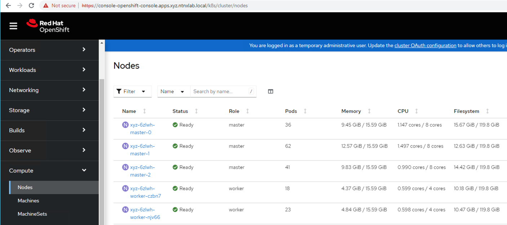

import Tabs from '@theme/Tabs';
import TabItem from '@theme/TabItem';

## Deploying OCP Cluster  

This will be simplest part of all, provided you have done everything correctly to this point. 

1. Start the installation of OCP cluster by executing the following

    ```mdx-code-block
    <details>
    <summary>Would you like to see verbose installation logs?</summary>
    <div>
    <body>

    Run the following command to start the installation of OCP cluster with verbose logging.
 
    ```bash 
    nohup openshift-install create cluster --log-level=debug &
    ```
    </body>
    </div>
    </details>
    
    ```bash 
    nohup openshift-install create cluster &
    ```
    ```bash title="Now you can follow the nohup logs to see installation progress"
    tail -f nohup.out
    ```

2. A typical installation flow would look like this
   
   :::caution

   This steps will take up to 40 minutes.

   :::

   ```buttonless {16,18} title="Install output - note the access information to the OCP cluster"
   openshift-install create cluster
   #
   INFO Consuming Master Machines from target directory 
   INFO Consuming OpenShift Install (Manifests) from target directory 
   INFO Consuming Common Manifests from target directory 
   INFO Consuming Openshift Manifests from target directory 
   INFO Consuming Worker Machines from target directory 
   INFO Creating infrastructure resources...         
   INFO Waiting up to 20m0s (until 8:16AM) for the Kubernetes API at https://api.ocpuser01.ntnxlab.local:6443... 
   INFO API v1.24.0+b62823b up                       
   INFO Waiting up to 30m0s (until 8:27AM) for bootstrapping to complete... 
   INFO Destroying the bootstrap resources...        
   INFO Waiting up to 40m0s (until 8:49AM) for the cluster at https://api.ocpuser01.ntnxlab.local:6443 to initialize... 
   INFO Waiting up to 10m0s (until 8:30AM) for the openshift-console route to be created... 
   INFO Install complete!                            
   INFO To access the cluster as the system:admin user when using 'oc', run 
   INFO     export KUBECONFIG=/home/ubuntu/auth/kubeconfig
   INFO Access the OpenShift web-console here: https://console-openshift-console.apps.ocpuser01.ntnxlab.local 
   INFO Login to the console with user: "kubeadmin", and password: "xxxx-xxxx-xxxx-xxxx" 
   INFO Time elapsed: 27m0s
   ```
3. Once the installation is done we can access OCP cluster using the following ways:

    ```text title="Export your kubeconfig file to env"
    export KUBECONFIG=/home/ubuntu/auth/kubeconfig
    ```

    ```bash
    oc get nodes
    ##
    NAME                     STATUS   ROLES    AGE     VERSION
    ocpuser01-6zlwh-master-0       Ready    master   14m   v1.24.0+b62823b
    ocpuser01-6zlwh-master-1       Ready    master   14m   v1.24.0+b62823b
    ocpuser01-6zlwh-master-2       Ready    master   14m   v1.24.0+b62823b
    ocpuser01-6zlwh-worker-czbn7   Ready    worker   14m   v1.24.0+b62823b
    ocpuser01-6zlwh-worker-njv66   Ready    worker   14m   v1.24.0+b62823b
    ocpuser01-6zlwh-worker-mlgbh   Ready    worker   14m   v1.24.0+b62823b
    ```

4. For GUI access, use the kubeadmin credentials listed in the ``nohup.out`` file

5. Add to the hosts file entry on your Mac/PC for accessing OCP UI with the following content:

    <Tabs groupId="Hosts File">
    <TabItem value="Template Hosts File" label="Template Hosts File">
 
     ```bash
     10.x.x.x     pc.ntnxlab.local
     10.x.x.x     console-openshift-console.apps.ocpuser0X.ntnxlab.local
     10.x.x.x     oauth-openshift.apps.ocpuser0X.ntnxlab.local 
     ```
 
    </TabItem>
    <TabItem value="Example Hosts Filed" label="Example Hosts File">
 
     ```bash
     10.42.18.7      pc.ntnxlab.local
     10.38.18.220    console-openshift-console.apps.ocpuser01.ntnxlab.local
     10.38.18.220    oauth-openshift.apps.ocpuser01.ntnxlab.local 
     ```
    </TabItem>
    </Tabs>
   
   From your Mac/PC, open Chrome

   Open the following URL
   
   ```url
   https://console-openshift-console.apps.ocpuser0X.ntnxlab.local
   ```
   
   
   You have successfully installed OCP using IPI.

:::note

Now that you have finished OCP IPI install, you can move on to the **OCP Command Access** section and then on to workloads section.

:::


## Cleanup (optional)

:::danger DO NOT Cleanup UNLESS .. 

Cleaning up (deleting) the OCP cluster should be done only in the following circumstances:

- You have finished all the labs.
- You have run into issues deploying OCP cluster and you would like to clean up the resources before redeploying OCP cluster.

:::

Run through the following if you would like to delete the OCP cluster. 

1. In your ``UserXX-LinuxToolsVM``

2. Change to you working directory that we created before (if not there already)

   ```bash
   cd /home/ubuntu/ocpuser01
   ```

3. Clean up with the following command:

   ```bash
   openshift-install destroy cluster 
   ```

   ```buttonless title="Output"
   INFO Starting deletion of Nutanix infrastructure for Openshift cluster "ocpuser01-6zlwh" 
   INFO Virtual machines scheduled to be deleted:    
   INFO - ocpuser01-6zlwh-master-2                         
   INFO - ocpuser01-6zlwh-master-1                         
   INFO - ocpuser01-6zlwh-master-0                         
   INFO - ocpuser01-6zlwh-worker-qzslg                     
   INFO - ocpuser01-6zlwh-worker-xjfk9    
   INFO - ocpuser01-6zlwh-worker-mlgbh                 
   INFO Deleting VM ocpuser01-6zlwh-master-2 with ID d7d5f8ac-6190-4708-93d7-c065f24f658c 
   INFO Deleting VM ocpuser01-6zlwh-master-1 with ID 050dca81-be33-4b9f-9868-44853810ea99 
   INFO Deleting VM ocpuser01-6zlwh-master-0 with ID 13adfbae-3b22-443e-88e9-e8e58d2be78e 
   INFO Deleting VM ocpuser01-6zlwh-worker-qzslg with ID 93a3efc8-cdc6-4df9-a5d5-0ba420e033ab 
   INFO Deleting VM ocpuser01-6zlwh-worker-xjfk9 with ID 056f313e-b426-4ec3-a740-2c2ccd8e83ef
   INFO Deleting VM ocpuser01-6zlwh-worker-mlgbh with ID 056f313e-b426-4ef6-a740-2c2ccd8e83vc 
   INFO Deleting image "ocpuser01-6zlwh-rhcos" with UUID "3001064e-46ce-4f62-b8d3-116a24eedf55" 
   INFO Deleting category value : shared             
   INFO Deleting category value : owned              
   INFO Deleting category key : kubernetes-io-cluster-ocpuser01-6zlwh 
   INFO Time elapsed: 32s   
   ```
   
IPI installation method is simple and consistent to deploy as after the pre-requisites are setup once.

Customers can easily deploy as many OCP clusters on Nutanix HCI.