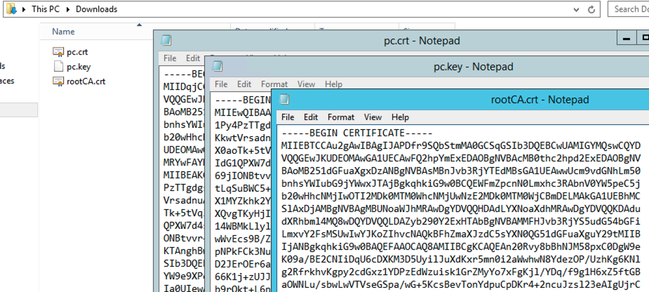
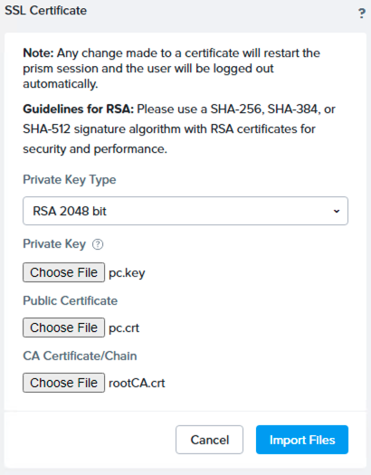
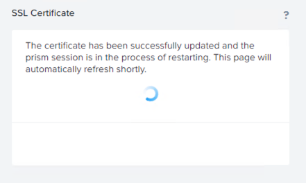
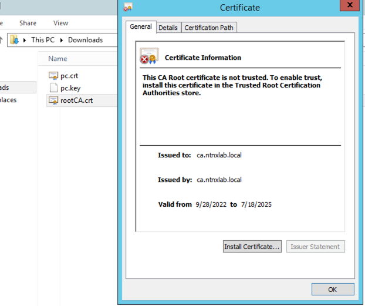
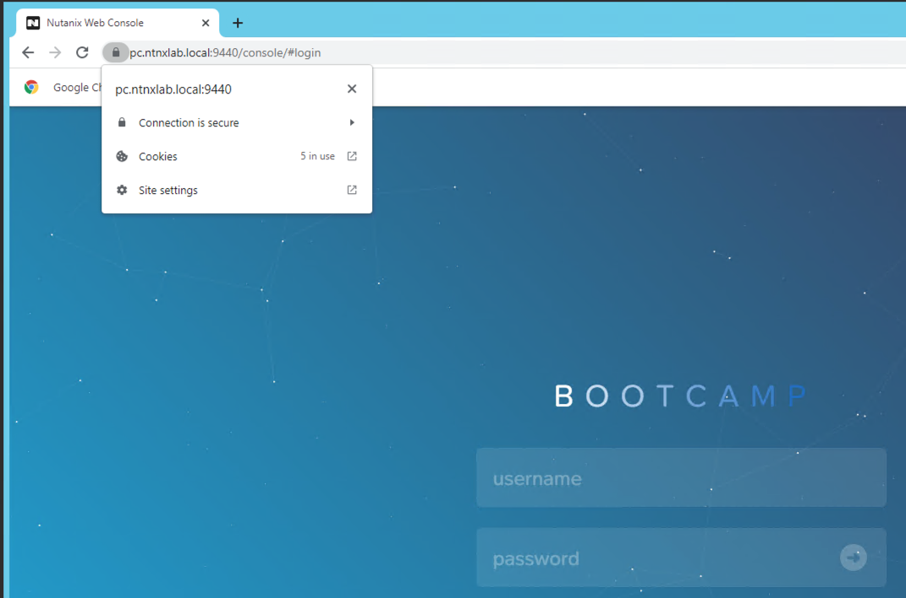

import Tabs from '@theme/Tabs';
import TabItem from '@theme/TabItem';


## Preparing Pre-requisites

We will be deploying OCP cluster using IPI method once the following pre-requisites are met. Be sure to make sure all pre-requisites are prepared.

### Preparing your HPOC cluster

:::caution Do you have enough compute resources?

We have planned enough resources in Nutanix cluster for you to deploy OCP cluster and workloads as well. 

For latest OCP resource requirements refer to OpenShift portal [here.](https://docs.openshift.com/container-platform/4.9/installing/installing_platform_agnostic/installing-platform-agnostic.html#installation-minimum-resource-requirements_installing-platform-agnostic)

At the time of writing this document the following resources are created by OCP IPI installer.
  
| OCP Role   |    Operating System    |    vCPU    |  RAM         | Storage   |         
| -------------|  ---------------------- |  -------- | ----------- |  --------- |  
| Master   x 3     |  RHCOS                 |  8        | 16 GB      |  120 GB   | 
| Worker    x 2   |  RHCOS, RHEL 7.9, or RHEL 8.4  |  4  |  16 GB      |  120 GB | 

> Additional space for bootstrap vms (deleted after install) and RHCOS image files are also accounted for.

:::

### AHV Networking 

We will first find two IPs for OCP ``api`` and ``apps`` ingress endpoints in our network and add it to the **Primary** IPAM network blacklist. 

1. Find the CIDR range for your  **Primary** IPAM network either from [RX](https://rx.corp.nutanix.com/) or from your instrutor

   ```buttonless title="CIDR example for your Nutanix cluster"
   10.38.18.192/26
   ```

2. Logon to your UserXX-LinuxToolsVM Terminal in the browser using ``code-server`` that you installed in the previous section

3. Find two unused static IP addresses

   <!-- ```bash
   cd $HOME/sol-cnai-infra/; devbox init; devbox shell
   ```
   ```bash title="Add nmap"
   devbox add nmap
   nmap -v -sn  <your HPOC CIDR> # Use Lookup Tool to find your cluster CIDR
   ``` -->
   <Tabs>
      <TabItem value="Template Command" label="Template Command" default>

      ```bash
      nmap -v -sn 10.x.x.x/x # use Nutanix Cluster's IPAM CIDR
      ```

      </TabItem>
      <TabItem value="Example Command" label="Example Command">

      ```bash
      nmap -v -sn 10.38.18.192/26 # use Nutanix Cluster's IPAM CIDR
      ```

      </TabItem>
   </Tabs>

   ```text {1,2} title="Sample output - choose the first two consecutive IPs"
   Nmap scan report for 10.38.18.219 [host down] 
   Nmap scan report for 10.38.18.220 [host down]
   Nmap scan report for 10.38.18.221
   Host is up (-0.098s latency).
   ```

4. Logon to any CVM in your cluster and execute the following to add chosen static IPs to the **Primary** IPAM network

   - Username: nutanix
   - Password: your cluster password # Use Lookup Tool to find your CVM/PE Cluster password
   
   <Tabs>
      <TabItem value="Template Command" label="Template Command" default>

      ```bash
      acli net.add_to_ip_blacklist <your-ipam-ahv-network> ip_list=10.38.18.219,10.38.18.220
      ```

      </TabItem>
      <TabItem value="Example Command" label="Example Command">

      ```bash title="Sample command"
      acli net.add_to_ip_blacklist Primary ip_list=10.38.18.219,10.38.18.220
      ```

      </TabItem>
   </Tabs>

### Add DNS Records

In this section we will add PC, API and APPS Ingress DNS records for lookup by OCP IPI installer.

Your OCP cluster's name becomes a subdomain in your DNS zone ``ntnxlab.local``. All OCP cluster related lookups are located within subdomain.

- Main domain -  ``ntnxlab.local`` (this gets created with your HPOC reservation)
  - Sub domain - ``ocpuserXX.ntnxlab.local`` (e.g. ocpuser01, ocpuser02, etc, is your OCP cluster's name)

1. Logon to the AutoAD windows VM 

   > **Username**: administrator

   > **Password**: default # Use lookup tool to find the password 

2. We will add the following entries to DNS server using the two consecutive IPs you found in the previous section
   
   :::caution Use your assigned HPOC cluster's IP Addresses

   The IP addresses in the following commands are used as an example. You should use IP address details that belong to your HPOC cluster. 
   
   For information on locating your cluster IP see [Lookup](https://lookup.howntnx.win) website.
   
   :::
   
   ```buttonless
   10.38.18.219   api.ocpuserXX.ntnxlab.local
   10.38.18.220   *.apps.ocpuserXX.ntnxlab.local
   10.38.18.201   pc.ntnxlab.local
   ```

2. Open PowerShell ISE as Administrator and create the two A records

   :::caution

   Create entry for Prism Central (pc) only if it is not present

   :::

    ```mdx-code-block
    <Tabs>
    <TabItem value="Template commands">
    ```
    ```PowerShell title="Add the API A record - use your own subdomain"
    Add-DnsServerResourceRecordA -Name api.<ocpuserXX> -IPv4Address <your API IP> -ZoneName ntnxlab.local -ZoneScope ntnxlab.local
    ```
    ```PowerShell title="Add the apps Ingress A record - use your own subdomain"
    Add-DnsServerResourceRecordA -Name *.apps.<ocpuserXX> -IPv4Address <your Ingress IP> -ZoneName ntnxlab.local -ZoneScope ntnxlab.local 
    ```
    ```PowerShell title="Optional - Add the Prism Central A record - if not present"
    Add-DnsServerResourceRecordA -Name pc -IPv4Address <your PC IP> -ZoneName ntnxlab.local -ZoneScope ntnxlab.local 
    ```
    ```mdx-code-block
    </TabItem>
    <TabItem value="Sample commands">
    ``` 
    ```buttonless title="Sample commands with 'ocpuser01' as a subdomain and your OCP cluster name"
    Add-DnsServerResourceRecordA -Name api.ocpuser01 -IPv4Address 10.38.18.219 -ZoneName ntnxlab.local -ZoneScope ntnxlab.local
    Add-DnsServerResourceRecordA -Name *.apps.ocpuser01 -IPv4Address 10.38.18.220 -ZoneName ntnxlab.local -ZoneScope ntnxlab.local 
    ```
    ```PowerShell title="Optional - Add the Prism Central A record - if not present"
    Add-DnsServerResourceRecordA -Name pc -IPv4Address 10.38.18.201 -ZoneName ntnxlab.local -ZoneScope ntnxlab.local
    ```
    ```mdx-code-block
    </TabItem>
    </Tabs>
    ```

3. Test name resolution for added entries

   ```PowerShell {6}
   nslookup api.ocpuser01.ntnxlab.local
   Server: dc.ntnxlab.local
   Address: 10.38.18.203

   Name: api.ocpuser01.ntnxlab.local
   Address: 10.38.18.219 
   ```
   ```bash {6}
   nslookup myapp.apps.ocpuser01.ntnxlab.local
   Server: dc.ntnxlab.local
   Address: 10.38.18.203

   Name: myapp.apps.ocpuser01.ntnxlab.local
   Address: 10.38.18.220
   ```
   ```bash {6}
   nslookup pc.ntnxlab.local
   Server: dc.ntnxlab.local
   Address: 10.38.18.203

   Name: pc.ntnxlab.local
   Address: 10.38.3.201
   ```

### Downloading OCP Tools 

We will need to the OCP tools mentioned in the pre-requisites section to prepare our environment

:::info OCP Tools information

You can get the URLs to download the tools and pull secret from RedHat Console: 

Openshift > Clusters > Create Clusters > Datacenter > [Nutanix AOS](https://console.redhat.com/openshift/install/nutanix/installer-provisioned)

In this section please using the download links provided is also ok. 
:::


1. Logon to UserXX-LinuxToolsVM 
   
2. Go to Terminal in ``VSCode`` on the browser

3. Create a folder under your user name from cluster lookup site (if you are in a lab environment)

   ```bash title="Use your user number - for example ocpuser01"
   cd $HOME
   mkdir ocpuserXX # e.g. `mkdir ocpuser01` / mkdir ocpuser01
   cd ocpuserXX # e.g. cd ocpuser01
   curl -O https://mirror.openshift.com/pub/openshift-v4/x86_64/clients/ocp/latest/openshift-client-linux.tar.gz
curl -O https://mirror.openshift.com/pub/openshift-v4/x86_64/clients/ocp/latest/openshift-install-linux.tar.gz
   ```

4. Extract the binaries and copy them to ``/usr/local/bin`` for pathless access
   
   ```bash
   tar xvf openshift-install-linux.tar.gz 
   tar xvf openshift-client-linux.tar.gz
   ```
   ```bash title="Adding to path"
   sudo cp kubectl /usr/local/bin
   sudo cp oc /usr/local/bin
   sudo cp openshift-install /usr/local/bin
   ```
5. Go to the [IPI Installer Web Console](https://console.redhat.com/openshift/install/nutanix/installer-provisioned) and click on **Copy pull secret** button

6. Now that the pull secret value is in your clipboard, paste the contents string to a pull secret file in the same directory

   ```bash
   vi pull_secret.json
   ```
7. Make sure all the files are in the ocpuserXX directory 

   ```bash
   ls -l 
   ```
   ```bash {5} title="Directory listing"
   -rwxr-xr-x 2 root root 123877776 Aug 29 16:30 kubectl
   -rwxr-xr-x 2 root root 123877776 Aug 29 16:30 oc
   drwxr-x--- 2 root root      4096 Sep 22 06:56 openshift
   -rwxr-xr-x 1 root root 481972224 Sep  1 16:07 openshift-install
   -rw-r--r-- 1 root root      2819 Sep 22 05:27 pull_secret.json
   ```
### Creating and Installing SSL Certificate on Prism Central

:::danger Sharing a Nutanix Cluster?

Only one person needs to do this section for generate and install SSL certificates for Prism Central.

If you are sharing a HPOC for multiple users, then you need to do this section only once. Decide with other participants sharing your cluster before proceeding.

Share the ``rootCA.crt`` certificate with the other users so they can use this to create OCP cluster.

:::

In this section we will do the following:

- Create a Root CA on your UserXX-LinuxToolsVM
- Create a Certificate Signing Request (CSR) for Prism Central 
- Sign the CSR using Root CA's private key

All this will be done on the UserXX-LinuxToolsVM.

1. In the UserXX-LinuxToolsVM, Create a the Root CA certificates

   ```bash
   openssl genrsa -des3 -out rootCA.key 2048
   ```
   ```text title="Execution example - make sure to retype the input values as shown here"
   # openssl genrsa -des3 -out rootCA.key 2048
   #
   Enter PEM pass phrase:              << Enter a passphrase (of at least 4 characters)
   Verifying - Enter PEM pass phrase:  << Re-enter the passphrase for confirmation
   ```   
2. Enter this command to create the pem file for rootCA 
   
   ```bash
   openssl req -x509 -new -nodes -key rootCA.key -sha256 -days 1825 -out rootCA.crt
   ```
   ```text title="Execution example - make sure to retype the input values as shown here"
   openssl req -x509 -new -nodes -key rootCA.key -sha256 -days 1825 -out rootCA.crt
   #
   Enter pass phrase for rootCA.key:   << Enter the passphrase created during .key file generation of rootCA
   You are about to be asked to enter information that will be incorporated
   into your certificate request.
   What you are about to enter is what is called a Distinguished Name or a DN.
   There are quite a few fields but you can leave some blank
   For some fields there will be a default value,
   If you enter '.', the field will be left blank.
   -----
   Country Name (2 letter code) [XX]:JP
   State or Province Name (full name) []:Chiba
   Locality Name (eg, city) [Default City]:Kashiwa
   Organization Name (eg, company) [Default Company Ltd]:nutanix
   Organizational Unit Name (eg, section) []:rootca
   Common Name (eg, your name or your server's hostname) []:rootca.ntnxlab.local
   Email Address []:first.last@nutanix.com
   ```

2. Create the following script. This script will be used to generate certificates for your Prism Central (can also be used to other servers)

   with the following name:

   ```bash
   vi gencert.sh
   ```
   Paste the following content in the script:

   ```text
   #!/bin/bash

   # Check if the number of arguments is at least 1 and at most 2
   if [ "$#" -lt 1 ] || [ "$#" -gt 2 ]; then
      echo "Usage: $0 <server-fqdn> [optional-second-dns]"
      exit 1
   fi

   # Assign the first argument to DOMAIN
   DOMAIN=$1

   # Assign the second argument to SECOND_DOMAIN, if provided
   SECOND_DOMAIN=$2

   # Generate private key and csr for the DOMAIN
   openssl genrsa -out $DOMAIN.key 2048
   openssl req -new -key $DOMAIN.key -out $DOMAIN.csr

   # Create a .ext file with SAN names for your DOMAIN and optional SECOND_DOMAIN
   cat > $DOMAIN.ext << EOF
   authorityKeyIdentifier=keyid,issuer
   basicConstraints=CA:FALSE
   keyUsage = digitalSignature, nonRepudiation, keyEncipherment, dataEncipherment
   subjectAltName = @alt_names
   [alt_names]
   DNS.1 = $DOMAIN
   EOF

   # Add SECOND_DOMAIN to the .ext file if it was provided
   if [ -n "$SECOND_DOMAIN" ]; then
   cat >> $DOMAIN.ext << EOF
   DNS.2 = $SECOND_DOMAIN
   EOF
   fi

   # Sign the csr using the rootCA key and cert
   openssl x509 -req -in $DOMAIN.csr -CA rootCA.crt -CAkey rootCA.key \
   -CAcreateserial -out $DOMAIN.crt -days 825 -sha256 -extfile $DOMAIN.ext
   ```

3. Provide execute permission to the script and execute it
   
   ```bash
   chmod u+x gencert.sh
   ```
4. Generate certificate(.pem) and private key (.key) for your Prism Central server

   ```bash
   # Format
   # ./gencert.sh <server fqdn>

   ./gencert.sh pc.ntnxlab.local
   ```
   ```text title="Execution example - make sure to retype the input values as shown here"
   ./gencert.sh pc.ntnxlab.local
   #
   You are about to be asked to enter information that will be incorporated
   into your certificate request.
   What you are about to enter is what is called a Distinguished Name or a DN.
   There are quite a few fields but you can leave some blank
   For some fields there will be a default value,
   If you enter '.', the field will be left blank.
   -----
   Country Name (2 letter code) [XX]:JP
   State or Province Name (full name) []:Chiba
   Locality Name (eg, city) [Default City]:Kashiwa
   Organization Name (eg, company) [Default Company Ltd]:nutanix
   Organizational Unit Name (eg, section) []:pc
   Common Name (eg, your name or your server's hostname) []:pc.ntnxlab.local
   Email Address []:first.last@nutanix.com

   Please enter the following 'extra' attributes
   to be sent with your certificate request
   A challenge password []:             << Enter a passphrase (of at least 4 characters)
   An optional company name []:nutanix
   Certificate request self-signature ok
   subject=C = JP, ST = Chiba, L = Kashiwa, O = pc, OU = pc, CN = pc.ntnxlab.local, emailAddress = first.last@nutanix.com
   Enter pass phrase for rootCA.key:    << Enter the passphrase created during .key file generation of rootCA
   ```


7. List the contents of the directory to make sure pc.crt, pc.key and rootCA.crt files are present

   ```bash
   ls -l *.pem *.crt *.key | awk '{print $9}'
   ```
   ```bash title="Output"
   pc.ntnxlab.local.crt               ## Prism Central's public certificate signed by Root CA
   pc.ntnxlab.local.key               ## Prism Central's private key
   rootCA.crt                         ## Root CA's public certificate
   rootCA.key                         ## Root CA's private key
   ```
   
8. ``cat`` out the contents of ``rootCA.crt``, ``pc.ntnxlab.local.key`` and ``pc.ntnxlab.local.crt`` and copy them to the UserXX-WindowsToolsPC in separate files

   ```buttonless
   cat rootCA.crt
   cat pc.ntnxlab.local.key
   cat pc.ntnxlab.local.crt
   ```

9. In UserXX-WindowsToolsPC, use Notepad to create three new files with the same names

10. Copy the ouput of previous cat command of ``rootCA.crt``, ``pc.ntnxlab.local.key`` and ``pc.ntnxlab.local.crt`` files into to your Mac/PC 

11. Logon to Prism Central Web GUI on the WindowsToolsVM

   ```url
   https://pc.ntnxlab.local/
   ```

12. Go to **Settings > SSL Certificate**

13. Click on **Replace Certificate** 

14. Select **Import Key and Certificate**

15. Click **Next**

16. Choose the following:
    
    > **Private Key Type** - RSA 2048 bit 
    
    > **Private Key** - ``pc.ntnxlab.local.key``
   
    > **Public Certificate** - ``pc.ntnxlab.local.crt``
    
    > **CA Certificate/Chain** - ``rootCA.crt``

   

17. Click on **Import Files**

    

18. Prism Central GUI will accept the certificate and restart for the changes to take effect. 

    

    You have now successfully installed SSL certificate on Prism Central.

    :::caution

    Do not proceed to the next steps until Prism Central Certificate is installed without errors. 

    Contact your lab instructors if you need help with troubleshooting SSL certificate issues.

    :::

19. To make sure that the WindowsToolsPC has the rootCA certificate installed in the local, double click on the ``rootCA.crt`` file in windows file explorer and select **install Certificate**

    

20. Choose **Local Machine** as Store Location and click **Next**

21. Choose **Place all certificates in the following store** and click **Browse**

22. Choose **Trusted Root Certification Authorities** and click **Next**

23. Click on **Finish**

24. You will notice that the browser has no warning about about an untrusted PC site 
     
    :::tip
    You may need to restart your browser if this isn't showing as a trusted site.
    :::

    

    You have completed the configuring SSL certificate pre-requisites for IPI installation. 

### Setting up Cloud Credential Operator Utility (CCOCTL)

Setting up of is necessary for Nutanix cluster credentials to be used with OCP cluster. 

Refer to [Cloud Credential Operator CCO](https://docs.openshift.com/container-platform/4.7/authentication/managing_cloud_provider_credentials/about-cloud-credential-operator.html) for more information. 

1. In the UserXX-LinuxToolsVM, download and setup ``ccoctl`` using the following commands

   ```bash
   cd $HOME/ocpuserXX # e.g. cd $HOME/ocpuser01
   ```
   ```bash
   RELEASE_IMAGE=$(openshift-install version | awk '/release image/ {print $3}')
   ```
   ```bash
   CCO_IMAGE=$(oc adm release info --image-for='cloud-credential-operator' $RELEASE_IMAGE)
   ```
   ```bash
   oc image extract $CCO_IMAGE --file="/usr/bin/ccoctl" -a pull_secret.json
   ```
   ```bash
   chmod u+x ccoctl
   ```

2. Make sure the ccoctl file is present 

   ```bash
   ls -lh ccoctl 
   ```
   ```bash title="Output"
   -rwxr----- 1 ubuntu ubuntu Apr 19 00:41 ccoctl
   ```
3. Create a Prism Central credentials file in ``creds`` directory

   ```bash {8,9}
   mkdir creds
   ##
   cat << EOF > creds/pc_credentials.yaml
   credentials:
   - type: basic_auth
     data:
       prismCentral:
         username: "admin"
         password: "PC-PASSWORD"
   EOF
   ```

4. Edit the ``pc_credentials.yaml`` file to change your Prism Central password

   ```bash
   vi creds/pc_credentials.yaml
   ```

4. Extract the CredentialsRequests objects for Nutanix Prism Central and store in a ``credreqs`` directory

   ```bash
   oc adm release extract --credentials-requests --cloud=nutanix --to=credreqs -a pull_secret.json $RELEASE_IMAGE
   ```

5. Use the ccoctl tool to process the CredentialsRequests objects and generate secret manifest files. These manifests file will be used during OCP cluster Certification

   ```bash
   ./ccoctl nutanix create-shared-secrets --credentials-requests-dir=credreqs --output-dir=. --credentials-source-filepath=creds/pc_credentials.yaml
   ```
   ```buttonless title="Output"
   2022/09/29 23:53:36 Saved credentials configuration to: manifests/openshift-machine-api-nutanix-credentials-credentials.yaml
   ```

6. Check the ``openshift-machine-api-nutanix-credentials-credentials.yaml`` file to make sure the contents are good using ``cat``
   
   ```bash
   cat manifests/openshift-machine-api-nutanix-credentials-credentials.yaml
   ```

   ```buttonless {8} title="Your credentials will be different"
   apiVersion: v1
   kind: Secret
   metadata:
      name: nutanix-credentials
      namespace: openshift-machine-api
   type: Opaque
   data:
      credentials: W3sidHlwZSI6ImJhc2ljX2F1dGgiLCJkYXRhIjp7InByaXNtQ2VudHJhbCI6eyJ1c2VybmFtZSI6ImFkbWluIiwicGFzc3dvcmQiOiJ0ZWNoWDIwMjAhIn0sInByaXNtRWxlbWVudHMiOm51bGx9fV0=
   ```

Now that we have all pre-requisites completed, let us move on to creating the OCP cluster IPI installation manifest
