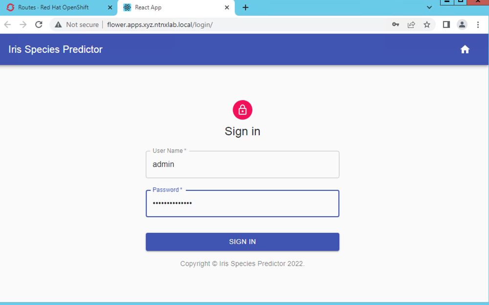
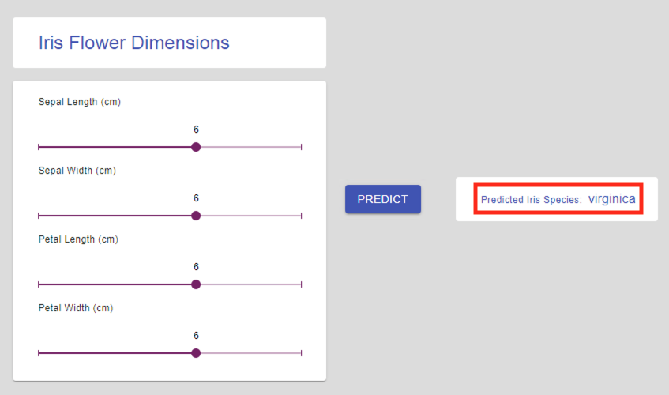
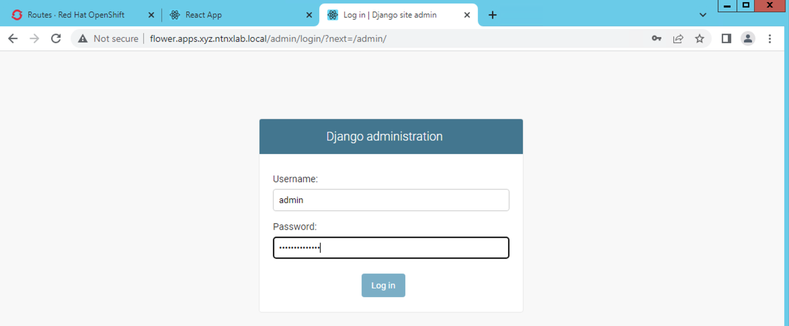
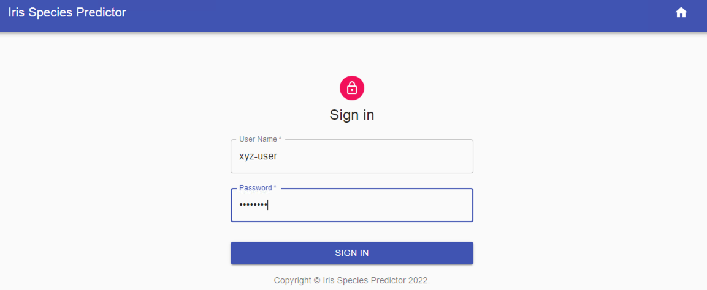
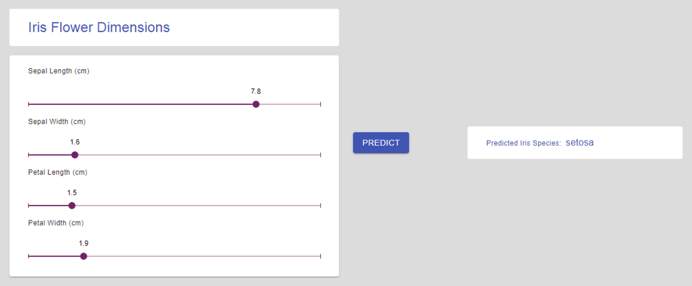

import Tabs from '@theme/Tabs';
import TabItem from '@theme/TabItem';

# OCP and Nutanix NDB

In this lab we will setup custom micro-service based application with VM based Nutanix Database [NDB](https://www.nutanix.com/products/database-service) service. 

In recent years, the growth of microservices has lead to use of VM based databases. Although microservices based databases are available,
customers are still using VM based databases as a datastore. The following may be the reason for customers using VM based databases (not limited to):

- Customer has majority of databases on VM platform 
- Customers DBA team has more expertise with VM based databases
- Cloud based database providers (AWS RDS) with several database engines are used prevalently
- Ease of deployment, scale and security (although security for microservices is improving at an exponential rate)
- Customer's extensive knowledge in providing high availability, disaster recovery and backups for these VM based databases
- Knowledge of implementing security practices for VMs in general 
- Customers are using VM based databases and are in the middle of migrating to microservices based databases
- Customers are using a hybrid database environment - both VM based and microservices based databases and have decided to stay this way

Nutanix NDB offers Databases as a service using NDB. Customers can provision hybrid multicloud DBaaS for Microsoft SQL Server, Oracle, PostgreSQL, MongoDB, and MySQL and be able to efficiently manage hundreds to thousands of databases.

:::info

Estimated time to complete this lab is **60 minutes**.

:::

```mdx-code-block

   <details>
   <summary>Fun fact</summary>
   <div>
   <body>
   NDB Operator was presented as a project in Nutanix Hackathon in 2022 by the Japan Solution Engineers (SE) team. The SEs identified a need in the  in the field for their customers and developed a version of the NDB Operator for OpenShift. 
   
   The team went to win the Hackathon tournament and NDB Operator is now an available solution for customers to take advantage of. This is testament of how Nutanix always have value to customers in mind. 
   </body>
   </div>
   </details>

```

## Pre-requisites for using NDB Deployed Databases

- NDB appliance deployed on the Nutanix cluster
- OCP cluster deployed on the Nutanix cluster - Check the following portions of this guide to create a OCP cluster:
  - [OCP with IPI Installer](../ocp_ipi_install/ocp_ipi_install.mdx) 
  - [OCP with Assisted Installer](../ocp_assisted_install/ocp_assisted_install.mdx) or 
  - [OCP with Nutanix Cloud Manager](../ocp_ntnx_hci/ocp_vms.mdx)
- Networking requirements adhering to OCP and Nutanix

:::note 

At the moment only **Postgres** databases are available to be deployed by NDB Operator for OCP. Nutanix will be adding other NDB capable database platforms (MSSQL, MYSQL, Oracle, etc.) incrementally. There are no ETAs at the moment. Please check Nutanix release announcements.

Nutanix provides 24x7x365 support for Postgres along with Postgres Professional. See this [Solution Brief](https://www.nutanix.com/content/dam/nutanix/partners/technology-alliances/solution-briefs/sb-postges-professional-and-nutanix.pdf) for more details. 
:::

## High Level Overview of NDB and OCP integration

At a very high level we will perform the following steps:

1. Install NDB Operator on the OCP cluster
2. Deploy a new NDB Postgres database
3. Install a custom application on OCP
4. Connect application to NDB Postgres database
   - Create database schema
   - Populate database with data 
5. Perform tasks at application level
6. Verify presence of data in NDB provisioned database

## Install NDB Operator on OCP

In this section we will install NDB operator and use yaml files to provision a database. The idea is simulate an environment where developers can create database resources as kubernets manifests.

This way developers can easily integrate VM based databases in their regular microservices based workflow.

### Prepare you Linux Tools VM

1. Logon to your Linux Tools VM using ubuntu user name and password on the browser
   
   :::tip Can't find the Linux Tools VM?

   If you don't have a Linux Tools VM deployed on your HPOC cluster, follow instructions in Appendix > Linux Tools VM page to deploy one.
   
   :::

2. Create a new directory in the home
   
   ```bash
   mkdir $HOME/ocpuserXX/ndb
   cd $HOME/ocpuserXX/ndb
   ```


1. Depending on you access to ``kubeconfig`` file or kubeadmin password, logon to the OCP cluster
   
    <Tabs groupId="Login Method">
    <TabItem value="kubeconfig file" label="kubeconfig">

    ```text title="Export your kubeconfig file to env"
    export KUBECONFIG=/home/ubuntu/ocpuserXX/auth/kubeconfig
    ```

    </TabItem>
    <TabItem value="kubeadmin credentials" label="kubeadmin">

    ```text title="Make sure to use your password"
    oc login -u kubeadmin -p xxxxx-xxxxx-xxxxx-xxxxx
    ```

    </TabItem>
    </Tabs>

2. Make sure your OCP cluster is accessible

   ```bash title="Ensure that you are getting output"
   oc get nodes
   ```

3. Install [latest version](https://cert-manager.io/docs/installation/#getting-started) of Cert Manager as a pre-requisite for NDB Operator
   
   ```bash
   oc apply -f https://github.com/cert-manager/cert-manager/releases/download/v1.13.1/cert-manager.yaml
   ```

4. Make sure all Cert Manager services are up and running

   ```bash
   oc get po -n cert-manager -w 
   ```
   
<!-- 7. We will install go language to be able to deploy the software

   :::caution Go version?

   At the time of writing this lab Go was 1.18.8 

   Make sure to download the stable version from [here](https://go.dev/doc/install).
   :::

   ```bash title="Download and install Go"
   wget https://go.dev/dl/go1.18.8.linux-amd64.tar.gz
   rm -rf /usr/local/go && tar -C /usr/local -xzf go1.18.8.linux-amd64.tar.gz
   ```
   ```bash title="Make sure the downloaded file is healthy"
   sha256sum go1.18.8.linux-amd64.tar.gz
   ```
   ```bash title="Compare output to the hash in the download site"
   4d854c7bad52d53470cf32f1b287a5c0c441dc6b98306dea27358e099698142a  go1.18.8.linux-amd64.tar.gz
   ```
   ```bash title="Add Go to path/env"
   export PATH=$PATH:/usr/local/go/bin
   source ~/.bash_profile
   ```
   ```bash title="Check Go version"
   go version
   ```
   ```bash title="Install build tools"
   yum groupinstall "Development Tools"
   ``` -->

### Install the NDB Operator for OCP

1. Add Nutanix's Helm repo
   
   ```bash
   helm repo add nutanix https://nutanix.github.io/helm/
   ```

2. Install NDB Operator using Helm
   
   ```bash
   helm install ndb-operator nutanix/ndb-operator --version 0.5.1 -n ndb-operator --create-namespace
   ```
   ```text title="Output"
   NAME: ndb-operator
   LAST DEPLOYED: Mon Dec 19 22:58:45 2022
   NAMESPACE: ndb-operator
   STATUS: deployed           # << Ensure the deployed state
   REVISION: 1
   TEST SUITE: None
   ``` 
   :::info
   
   The operator will be deployed in ``ndb-operator`` namespace/project.
   
   :::

3. Ensure all the resources are healthy in the ``ndb-operator`` namespace/project.

   ```bash
   oc get all -n ndb-operator
   ```
   ```text title="Output"
   #
   NAME                                                   READY   STATUS    RESTARTS   AGE
   pod/ndb-operator-controller-manager-77fcb496d5-7qcfc   2/2     Running   0          2m16s
   
   NAME                                                      TYPE        CLUSTER-IP       EXTERNAL-IP   PORT(S)    AGE
   service/ndb-operator-controller-manager-metrics-service   ClusterIP   172.30.244.194   <none>        8443/TCP   2m16s
   
   NAME                                              READY   UP-TO-DATE   AVAILABLE   AGE
   deployment.apps/ndb-operator-controller-manager   1/1     1            1           2m16s
   
   NAME                                                         DESIRED   CURRENT   READY   AGE
   replicaset.apps/ndb-operator-controller-manager-77fcb496d5   1         1         1       2m16s
   ```

   :::tip

   You can follow the logs of the ``ndb-operator-controller-manager`` ``deployment`` to see the activities of the NDB Operator.

   ```bash
   oc logs -f deployment.apps/ndb-operator-controller-manager -n ndb-operator
   ```
   
   :::

<!-- 1. Change to the downloaded NDB opertor git repo folder (if not already there)
   
    ```bash 
    cd /home/ubuntu/ndb-operator
    ```

2. Install the NDB Operator/Controller on OCP

    ```bash
    make deploy
    ```
    ```text title="Output - make sure there are no errors"
    /home/nutanix/ndb-operator/bin/controller-gen rbac:roleName=manager-role crd webhook paths="./..." output:crd:artifacts:config=config/crd/bases
    test -s /home/nutanix/ndb-operator/bin/kustomize || { curl -s "https://raw.githubusercontent.com/kubernetes-sigs/kustomize/master/hack/install_kustomize.sh" | bash -s -- 4.5.5 /home/nutanix/ndb-operator/bin; }
    cd config/manager && /home/nutanix/ndb-operator/bin/kustomize edit set image controller=ghcr.io/nutanix-cloud-native/ndb-operator/controller:v0.0.2
    /home/nutanix/ndb-operator/bin/kustomize build config/default | kubectl apply -f -
    namespace/ndb-operator-system created
    customresourcedefinition.apiextensions.k8s.io/databases.ndb.nutanix.com created
    serviceaccount/ndb-operator-controller-manager created
    role.rbac.authorization.k8s.io/ndb-operator-leader-election-role created
    clusterrole.rbac.authorization.k8s.io/ndb-operator-manager-role created
    clusterrole.rbac.authorization.k8s.io/ndb-operator-metrics-reader created
    clusterrole.rbac.authorization.k8s.io/ndb-operator-proxy-role created
    rolebinding.rbac.authorization.k8s.io/ndb-operator-leader-election-rolebinding created
    clusterrolebinding.rbac.authorization.k8s.io/ndb-operator-manager-rolebinding created
    clusterrolebinding.rbac.authorization.k8s.io/ndb-operator-proxy-rolebinding created
    configmap/ndb-operator-manager-config created
    service/ndb-operator-controller-manager-metrics-service created
    Warning: would violate PodSecurity "restricted:v1.24": unrestricted capabilities (containers "kube-rbac-proxy", "manager" must set securityContext.capabilities.drop=["ALL"]), seccompProfile (pod or containers "kube-rbac-proxy", "manager" must set securityContext.seccompProfile.type to "RuntimeDefault" or "Localhost")
    deployment.apps/ndb-operator-controller-manager created 
    ``` -->

## Create NDB Postgres DB 

In this section we will create a Postgres database using NDB Operator. 

### High Level Steps

1. NDB operator will communicate with NDB server with a create database request 
2. NDB server will create the Postgres database VM (instance) and postgres database
3. NDB server will respond to NDB Operator with the result of the requested operation

### Prepare Secrets for your Database Server and Database

1. Create a new OCP project
   
   ```bash
   oc new-project ndb
   ```

2. Create a secret for NDB Operator to access NDB server

   ```bash
   cat << EOF > your-ndb-secret.yaml
   apiVersion: v1
   kind: Secret
   metadata:
     name: your-ndb-secret
   type: Opaque
   stringData:
     username: ndb-username
     password: ndb-password
   EOF
   ```
3. Edit the manifest with your NDB server credentials and save it
   
   ```bash 
   vi your-ndb-secret.yaml
   ```
4. Apply the manifest to create NDB server credentials secret
   
   ```bash 
   oc apply -f your-ndb-secret.yaml
   ```
   
5. Create a secret with credentials (password and ssh public key) for the new Postgres VM that you will be provisioning.

   SSH key is a requirement. This must be included to authenticate to your NDB deployed VM. ``Database`` resource will fail to deploy if **ssh-public-key** is not included.
  
   ```bash
   cat << EOF > your-db-secret.yaml
   apiVersion: v1
   kind: Secret
   metadata:
     name: your-db-secret        
   type: Opaque
   stringData:
     password: postgres_password   # << Do not change this for now
     ssh_public_key: ssh-rsa AAAAB3NzaC1yc2EAAAADAQABAAABAQ....            # << this must be present
   EOF
   ```
   ```mdx-code-block

   <details>
   <summary>No SSH-PUBLIC-KEY?</summary>
   <div>
   <body>

   :::tip 

   If you do not have a **SSH-PUBLIC-KEY**, use the ``ssh-keygen`` command on your **Linux Tools VM** to create a ssh key pair

   Remember to keep it safe somewhere. 

   ```bash
   ssh-keygen -t rsa -b 2048 -f ~/.ssh/for_ndb   # << accept all default answers
   ls -l ~/.ssh/
   ## Output here
   ~/.ssh/for_ndb.pub  # << use this public key in the your-db-secret manifest 
   ~/.ssh/for_ndb      # << use this private key to logon to the NDB deployed database server
   ```
   </body>
   </div>
   </details>


   ```bash title="Edit the manifest with your Postgres DB server credentials"
   vi your-db-secret.yaml
   ```
   ```bash title="Apply the manifest to create your Postgres DB server credentials secret"
   oc apply -f your-db-secret.yaml
   ```
   
### Get NDB Cluster's UUID

We will use curl command to get the Era's cluster UUID in this section. 

1. Logon to the  Linux Tools VM using your credentials
   
2. Set the env for NDB VMs IP address 
   
   ```mdx-code-block
   <Tabs>
   <TabItem value="Template command">
   ```
   ```bash 
   NDB_IP=_your_ndb_vm_ip
   echo $NDB_IP
   ``` 
   
   ```mdx-code-block

   </TabItem>
   ```
   ```mdx-code-block
   <TabItem value="Sample command">
   ```
   ```bash
   NDB_IP=10.42.12.18
   10.42.12.18
   ``` 
   ```mdx-code-block
   </TabItem>
   </Tabs>
   ```

3. Execute the following command to get Era cluster's UUID. We will use this in our database configuration file in the next section. 

   ```mdx-code-block
   <Tabs>
   <TabItem value="Template command">
   ```
   ```bash 
   NDB_UUID="$(curl -X GET -u admin -k https://$NDB_IP/era/v0.9/clusters | jq '.[0].id')"
   echo $NDB_UUID
   ``` 
   
   ```mdx-code-block

   </TabItem>
   ```
   ```mdx-code-block
   <TabItem value="Sample command">
   ```
   ```bash
   NDB_UUID="$(curl -X GET -u admin -k https://10.42.12.18/era/v0.9/clusters | jq '.[0].id')"
   "eafdb83c-e512-46ce-8d7d-6859dc170272"
   ``` 
   ```mdx-code-block
   </TabItem>
   </Tabs>
   ```
   ```console title="Sample execution and output"
   curl -X GET  -u admin -k https://10.42.12.108/era/v0.9/clusters |  jq '.[0].id'

   Enter host password for user 'admin':   # << Enter your Era server's password here
   
   "eafdb83c-e512-46ce-8d7d-6859dc170272"  # << This uuid will be different for all Era clusters.
   ```


4. Record the Era server's cluster UUID 

### Create NDB Compute Profile

Create a NDB compute profile that can be used for our Postgres database

1. In NDB > Go to Profiles > Compute Profile
2. Create a new compute profile
   
   - **Name** - DEFAULT_OOB_SMALL_COMPUTE
   - **CPUS** - 4
   - **CORE_PER_CPU** - 2
   - **MEMORY** - 8
  
<!-- 1. Prepare base64 version of NDB login credentials
   
   ```bash 
   NDB_SERVER_PASSWORD="xxxxxxx"
   NDB_CREDS_HASH=$(echo admin:$NDB_SERVER_PASSWORD | base64)
   ```
1. Send a REST call to NDB VM to create the compute profile

   ```bash
   curl -v -k -X POST \
     "https://${NDB_IP}/v0.9/profiles" \
     -H "Content-Type: application/json" \
     -H "Authorization: Basic ${NDB_CREDS_HASH}" \
     -d @- <<EOF
   {
     "type": "Compute",
     "topology": "ALL",
     "dbVersion": "ALL",
     "systemProfile": false,
     "properties": [
       {
         "name": "CPUS",
         "value": "4",
         "secure": false,
         "description": "Number of CPUs in the VM"
       },
       {
         "name": "CORE_PER_CPU",
         "value": "2",
         "secure": false,
         "description": "Number of cores per CPU in the VM"
       },
       {
         "name": "MEMORY_SIZE",
         "value": "8",
         "secure": false,
         "description": "Total memory (GiB) for the VM"
       }
     ],
     "name": "DEFAULT_OOB_SMALL_COMPUTE",
     "description": ""
   }
   EOF
   ``` -->

### Create Postgres Database using the NDB Operator

1. Create a ``NDBServer`` server resource by using the following manifest:

   ```bash
   cat << EOF > ndbserver.yaml 
   apiVersion: ndb.nutanix.com/v1alpha1
   kind: NDBServer
   metadata:
     labels:
       app.kubernetes.io/name: ndbserver
       app.kubernetes.io/instance: ndbserver
       app.kubernetes.io/part-of: ndb-operator
       app.kubernetes.io/managed-by: kustomize
       app.kubernetes.io/created-by: ndb-operator
     name: ndb
   spec:
      # Name of the secret that holds the credentials for NDB: username, password and ca_certificate created earlier
      credentialSecret: your-ndb-secret
      # NDB Server's API URL
      server: https://$NDB_IP:8443/era/v0.9
      # Set to true to skip SSL certificate validation, should be false if ca_certificate is provided in the credential secret.
      skipCertificateVerification: true
   EOF
   ```

2. Connect the OCP cluster to your NDB server by applying the manifest you created
   
   ```bash
   oc apply -f ndbserver.yaml
   ```

3. Choose a name for your DB server
   
   ```bash
   MY_DB_SERVER_NAME=ocpuserXX # e.g ocpuser01
   echo $MY_DB_SERVER_NAME
   ```

4. Create a Database resource by using the following manifest

   ```bash {6,13,20,25}
   cat << EOF > database.yaml
   apiVersion: ndb.nutanix.com/v1alpha1
   kind: Database
   metadata:
   # This name that will be used within the kubernetes cluster
     name: dbforflower                                     # << This will be our kubernetes database object's name
   spec:
     # Name of the NDBServer resource created earlier
     ndbRef: ndb
     isClone: false
     # Database instance specific details (that is to be provisioned)
     databaseInstance:
       clusterId: $NDB_UUID
       # Example
       # clusterId: "a913265b-377c-44cf-8984-d049ade62585"
       # The database instance name on NDB
       # profiles:
       #   software:
       #     name: "POSTGRES_15.6_ROCKY_LINUX_8_OOB"
       name: "$MY_DB_SERVER_NAME"                        # << change this to your ocpuser name
       # Example
       #name: "pgserver_ocpuser01"
       # Names of the databases on that instance
       databaseNames:
         - predictiondb                                  # << this will be our database name
       # Credentials secret name for NDB installation
       # data: password, ssh_public_key
       credentialSecret: your-db-secret
       size: 10
       timezone: "UTC"
       type: postgres
   EOF
   ```

5. Edit the ``database.yaml`` file to populate with your environment details
   
   ```bash
   vi database.yaml
   ```

6. Create the NDB ``Database`` resource
   ndb
   ```bash
   oc apply -f database.yaml
   ```

7. Check the status of the deployment

   ```bash
   oc get database 
   ```
   ```text title="Output - you will see provisioning status"
   NAME          IP ADDRESS   STATUS     TYPE
   dbforflower                CREATING
   ```  
   
8. You can also track the progress of the database deployment by looking at the ``ndb-operator-controller-manager`` pod logs in ``ndb-operator-system`` namespace

   ```bash title="Make sure to use your pod name"
   oc logs -f deployment.apps/ndb-operator-controller-manager -n ndb-operator
   ```

9.  You can also login to the NDB web page to see the progress. 
   
   In NDB UI, Select **Menu** **Operations**

   

:::info 

It will take about **20 minutes** to provision the ``pgserver`` database server and ``predictiondb`` database.

Refer to the following document for other database creation option with [NDB Options](https://github.com/nutanix-cloud-native/ndb-operator)

:::

### Check Database Connectivity

1. Check the status of NDB deployed database in OCP
    
    ```bash
    oc get database 
    ```
    ```text title="Output - note the READY status and the IP address of the database VM"
    NAME          IP ADDRESS    STATUS   TYPE
    dbforflower   10.38.13.45   READY    postgres
    ```

11. NDB Operator also creates a service and an endpoint(IP+Port) for you to access the database server 
    
    ```bash
    oc get service,ep 
    ```
    ```text title="Output - note the Cluster IP, endpoint's external IP and port number"
    NAME                      TYPE        CLUSTER-IP       EXTERNAL-IP   PORT(S)   AGE
    service/dbforflower-svc   ClusterIP   172.30.188.239   <none>        80/TCP    73s

    NAME                        ENDPOINTS          AGE                               
    endpoints/dbforflower-svc   10.38.13.45:5432   73s # << This is IP of the PostGres server deployed by NDB   
    ```
    The database is now available as an ``ClusterIP`` resource on port ``80``service to other workloads.

    We just need to use the ``ClusterIP`` of the database service to connect from the front end application pod.

12. Check if you are able to connect to you database. We will do this by deploying a standalone postgres pod.
    
    ```bash title="Set SCC to run PSQL pod"
    oc adm policy add-scc-to-user anyuid -z default
    ```

    ```bash title="Deploy the PSQL pod"
    cat << EOF | oc apply -f -
    apiVersion: v1
    kind: Pod
    metadata:
      name: psql
    spec:
      restartPolicy: Never
      containers:
      - name: psql 
        image: alpine/psql
        command: ["/bin/sh", "-c", "echo 'Pod is running' && sleep 7200"]
        env:
        - name: POSTGRES_PASSWORD
          value: postgres_password
        securityContext:
          allowPrivilegeEscalation: true
    EOF
    ```
    ```bash title="Login to the PSQL pod and connect to the database server"
    oc exec -it psql -- /bin/sh
    ```
    ```bash title="Inside the PSQL pod, logon to the predictiondb database"
    psql -h dbforflower-svc -p 80 -U postgres -d predictiondb
    ```

    ```bash title="Enter the password you used in your-db-secret.yaml file"
    # psql -h dbforflower-svc -p 80 -U postgres -d predictiondb
    Password for user postgres: 
    psql (9.4.5, server 10.4)
    WARNING: psql major version 9.4, server major version 10.4.
             Some psql features might not work.
    Type "help" for help.
    
    predictiondb=#
    ```
    ```bash title="Run \du command to list the users"
    predictiondb=# \du 
                                                            List of roles
      Role name       |                   Attributes                   |                          Member of                           
    ----------------------+------------------------------------------------+--------------------------------------------------------------
    pg_monitor           | Cannot login                                   | {pg_read_all_settings,pg_read_all_stats,pg_stat_scan_tables}
    pg_read_all_settings | Cannot login                                   | {}
    pg_read_all_stats    | Cannot login                                   | {}
    pg_signal_backend    | Cannot login                                   | {}
    pg_stat_scan_tables  | Cannot login                                   | {}
    postgres             | Superuser, Create role, Create DB, Replication | {}
    ```

You are able to connect to the database without leaving the OCP command line environment. This is what most developers and devops engineers will have access to, so they can deploy applications. 

## Installing a Custom Three-layer Application 

In this section we will install a three-layer application (front end, back end and database) to showcase the value of NDB Operator to a customer.

:::note References
All ideas for this three-layer this application come from this [blog](https://www.datagraphi.com/blog/post/2021/2/10/kubernetes-guide-deploying-a-machine-learning-app-built-with-django-react-and-postgresql-using-kubernetes).

We have only modified the implementation to suit deployment in a OCP cluster with NDB deployed Postgres database.
:::

### Create Database Schema and Data

1. Apply the application secrets manifest
   
   ```bash
   oc apply -f https://raw.githubusercontent.com/nutanix-japan/ocp-gitp/main/docs/ocp_ndb/k8s/app-secrets.yaml
   ```
2. Download and edit the configmap to match your database service name and port number (if you used a different database name in your ``ndb.yaml``  manifest)

   ```bash
   curl -LO https://raw.githubusercontent.com/nutanix-japan/ocp-gitp/main/docs/ocp_ndb/k8s/app-variables.yaml
   ```
3. Edit you ``app-variables.yaml`` file to match your DB_HOST service name and DB_PORT port number
   
   ```mdx-code-block
    <Tabs>
    <TabItem value="Template file">
    ```
    ```bash {23,24}
    apiVersion: v1
    kind: ConfigMap
    metadata:
       name: app-variables
    data:
       #env variables for the postgres component
       POSTGRES_USER: postgres_user
       POSTGRES_DB: predictiondb
    
       #env variables for the backend component
       DJANGO_ENV: development
       DEBUG: "1"
       SECRET_KEY: secretsecretsecretsecretsecret
       DJANGO_ALLOWED_HOSTS: "*"
       DJANGO_ADMIN_USER: admin
       DJANGO_ADMIN_EMAIL: "admin@example.com"
       
       #db server components
       DATABASE: postgres
       DB_ENGINE: "django.db.backends.postgresql"  
       DB_DATABASE: predictiondb
       DB_USER: postgres 
       DB_HOST: <your DB service>                  #  << Match your database service
       DB_PORT: <your DB port>                     #  << Match your database service's port number
    ```
    ```mdx-code-block
    </TabItem>
    <TabItem value="Sample file">
    ``` 
    ``` bash  {23,24}
    apiVersion: v1
    kind: ConfigMap
    metadata:
       name: app-variables
    data:
       #env variables for the postgres component
       POSTGRES_USER: postgres_user
       POSTGRES_DB: predictiondb
    
       #env variables for the backend component
       DJANGO_ENV: development
       DEBUG: "1"
       SECRET_KEY: secretsecretsecretsecretsecret
       DJANGO_ALLOWED_HOSTS: "*"
       DJANGO_ADMIN_USER: admin
       DJANGO_ADMIN_EMAIL: "admin@example.com"
       
       #db server components
       DATABASE: postgres
       DB_ENGINE: "django.db.backends.postgresql"  
       DB_DATABASE: predictiondb
       DB_USER: postgres 
       DB_HOST: dbforflower-svc
       DB_PORT: "80"
    ```
    ```mdx-code-block
    </TabItem>
    </Tabs>


4. After making sure that your database service name and port number matches, apply the configmap manifest
   
   ```bash 
   oc apply -f app-variables.yaml
   ```

5. Run this job to populate your database with schema and data
   
   ```bash
   oc apply -f https://raw.githubusercontent.com/nutanix-japan/ocp-gitp/main/docs/ocp_ndb/k8s/django-job.yaml
   ```

6. Monitor the job to make sure it has completed
   
   ```bash
   oc get job django-job -w
   ```
   ```text title="Output"
   # oc get job -w
   NAME         COMPLETIONS   DURATION   AGE
   django-job   0/1           14s        15s
   django-job   0/1           14s        15s
   django-job   0/1           17s        18s
   django-job   1/1           19s        20s   # << Wait for completion
   ```
   
7. You can analyse the logs to make sure the job has completed without any issues

   ```bash title="Analyse the pod logs - your pod name will be different"
   oc logs django-job-cmcxk
   ```
   ```bash title="You must see migration jobs runnig - ignore warnings"
   Running migrations:
   Applying contenttypes.0001_initial... OK
   Applying auth.0001_initial... OK
   Applying admin.0001_initial... OK
   Applying admin.0002_logentry_remove_auto_add... OK
   Applying admin.0003_logentry_add_action_flag_choices... OK
   Applying contenttypes.0002_remove_content_type_name... OK
   Applying auth.0002_alter_permission_name_max_length... OK
   Applying auth.0003_alter_user_email_max_length... OK
   Applying auth.0004_alter_user_username_opts... OK
   Applying auth.0005_alter_user_last_login_null... OK
   Applying auth.0006_require_contenttypes_0002... OK
   Applying auth.0007_alter_validators_add_error_messages... OK
   Applying auth.0008_alter_user_username_max_length... OK
   Applying auth.0009_alter_user_last_name_max_length... OK
   Applying auth.0010_alter_group_name_max_length... OK
   Applying auth.0011_update_proxy_permissions... OK
   Applying auth.0012_alter_user_first_name_max_length... OK
   Applying authtoken.0001_initial... OK
   Applying authtoken.0002_auto_20160226_1747... OK
   Applying sessions.0001_initial... OK
   ```

   :::tip what if my job fails?
   You would have to troubleshoot. 
   
   Delete your job, change any references in **app_variables** config map that may have been wrong, and re-run the job.

   ```bash
   oc delete -f django-job.yaml
   oc apply -f django-job
   oc get job django-job -o json | oc replace --force -f -
   ```

8. Log back into the database to check if there are new tables 
   
    ```bash title="Login to the pod and connect to database server"
    oc exec -it psql -- /bin/sh
    ```
    ```bash title="Inside the Postgres pod, logon to the predictiondb database"
    psql -h dbforflower-svc -p 80 -U postgres -d predictiondb
    ```

    ```bash title="Enter postgres_password as the password"
    # psql -h dbforflower-svc -p 80 -U postgres -d predictiondb
    Password for user postgres: 
    psql (9.4.5, server 10.4)
    WARNING: psql major version 9.4, server major version 10.4.
             Some psql features might not work.
    Type "help" for help.
    
    predictiondb=#
    ```
    ```bash title="You should see 11 tables created"
    predictiondb=# \dt
                   List of relations
     Schema |            Name            | Type  |  Owner   
    --------+----------------------------+-------+----------
     public | auth_group                 | table | postgres
     public | auth_group_permissions     | table | postgres
     public | auth_permission            | table | postgres
     public | auth_user                  | table | postgres
     public | auth_user_groups           | table | postgres
     public | auth_user_user_permissions | table | postgres
     public | authtoken_token            | table | postgres
     public | django_admin_log           | table | postgres
     public | django_content_type        | table | postgres
     public | django_migrations          | table | postgres
     public | django_session             | table | postgres
    (11 rows)
    ```
### Install Front End and Back End applications

1. Run the following commands to create the front end and back end applications 

   ```bash
   oc apply -f https://raw.githubusercontent.com/nutanix-japan/ocp-gitp/main/docs/ocp_ndb/k8s/django-deployment.yaml
   oc apply -f https://raw.githubusercontent.com/nutanix-japan/ocp-gitp/main/docs/ocp_ndb/k8s/react-deployment.yaml
   ```
   ```bash title="Output - you will see deployments and services created"
   deployment.apps/django-deployment created
   service/django-cluster-ip-service created
   #
   deployment.apps/react-deployment created
   service/react-cluster-ip-service created
   ```
2. Make sure all the pods are running 
   
   ```bash title="Make sure all pods are running"
   oc get po 
   ```
   ```bash title="Output"
   oc get po 
   NAME                                 READY   STATUS      RESTARTS   AGE
   django-deployment-5b96897c59-cqhmp   1/1     Running     0          2m15s
   django-deployment-5b96897c59-m927z   1/1     Running     0          2m15s
   django-job-sbctr                     0/1     Completed   0          28m
   psql                                 1/1     Running     0          114m
   react-deployment-cdff5fdbf-28mnq     1/1     Running     0          2m13s
   react-deployment-cdff5fdbf-5dhm5     1/1     Running     0          2m13s
   ```

### Create Routes to Access the Application 

We will need to create routes to access the front end and back end applications. 

You can access the application through the OCP Routes. 

1. Download the routes file

    ```bash 
    curl -LO https://raw.githubusercontent.com/nutanix-japan/ocp-gitp/main/docs/ocp_ndb/k8s/routes.yaml
    ```

2. Change the URL in the downloaded file to suit OCP cluster name and your domain.

    > **OCP Cluster Name** - ocpuserXX (change to your  OCP cluster name)

    > **Domain**           - ntnxlab.local 

4. Using ``sed`` command this can be done in a single command
  
    ```mdx-code-block
    <Tabs>
    <TabItem value="Template command">
    ```
    ``` bash
    sed -i 's/ROUTE_HOST/flower.apps. <ocpuserXX> .ntnxlab.local/g' routes.yaml
    ```
    ```mdx-code-block
    </TabItem>
    <TabItem value="Sample command">
    ``` 
    ``` bash 
    sed -i 's/ROUTE_HOST/flower.apps.ocpuser01.ntnxlab.local/g' routes.yaml
    ```
    ```mdx-code-block
    </TabItem>
    </Tabs>
    ```

3. Create the routes 

    ```bash
    oc apply -f routes.yaml
    ```
    ```bash title="Check the routes"
    oc get routes | awk '{print $1,$2,$3}'
    ```
    ```text title="Output"
    NAME           HOST/PORT                                         PATH
    route-path-a   flower.apps.ocpuserXX.ntnxlab.local    /
    route-path-b   flower.apps.ocpuserXX.ntnxlab.local    /admin
    route-path-c   flower.apps.ocpuserXX.ntnxlab.local    /api
    route-path-d   flower.apps.ocpuserXX.ntnxlab.local    /static/admin/
    route-path-e   flower.apps.ocpuserXX.ntnxlab.local    /static/rest_framework/
    route-path-f   flower.apps.ocpuserXX.ntnxlab.local    /static/
    route-path-g   flower.apps.ocpuserXX.ntnxlab.local    /media/
    ```

### Testing Front End React Application 

2. Logon to your Windows Tools VM 
   
    > **Username** - administrator@ntnxlab.local

    > **Password** - nutanix default

3. Open the following URL in Chrome browser to access the Front End React application
   
    ```url 
    http://flower.apps.ocpuserXX.ntnxlab.local/
    ```
    ```mdx-code-block
    <Tabs>
    <TabItem value="Template URL">
    ```
    ```url 
    http://flower.apps.ocpuserXX.ntnxlab.local/
    ```
    ```mdx-code-block
    </TabItem>
    <TabItem value="Sample URL">
    ``` 
    ```url 
    http://flower.apps.ocpuser01.ntnxlab.local/
    ```
    ```mdx-code-block
    </TabItem>
    </Tabs>
    ```

4. Enter the following credentials and click on **SIGN IN**

    > **Username** - admin

    > **Password** - admin_password

    
   
5. Move the sliders across and click on **Predict** to get flower names based on their physical attributes

    

Now that we have finished testing the front end React application, let's move on to testing back end Django application.

### Testing Back End Django Application 

Django application is used to manage users that will access and manage the front end React application.

We will create a new user in the Django application which we will then use in authenticating to front end React application.

1. Open the following URL in Chrome browser to access the Front End React application
   
    ```url 
    http://flower.apps.ocpuserXX.ntnxlab.local/admin 
    ```

2. Enter the following credentials and click on **SIGN IN**

    > **Username** - admin

    > **Password** - admin_password
 
    

3. Click on **+ Add** to add users 

    

4. Enter the following details:
    
    > **Username** - *Your-Initials-user* (e.g. xyz-user)

    > **Password** - password of your choice (make sure to remember this)
    
    > **Password confirmation** - re-enter the password of your choice

5. Click on **SAVE**

6. Check the confirmation message 
   
    

7. Return to front end React application and test the new credentials. 

8. Check if you are able to login with the newly created credentials. Play around with the flower name prediction AI application and have some fun.

    ```url 
    http://flower.apps.ocpuserXX.ntnxlab.local/admin 
    ```
    
    > **Username** - *Your-Initials-user* (e.g. xyz-user)
    
    > **Password** - password of your choice from previous step
 
    
 
    

### Checking Postgres Database Data 

In this section we will confirm that the new user we created in from the back end Django app is present in the database 

1. Log back into the database to check if there are new users 
   
    ```bash title="Login to the psql pod and connect to database server"
    oc exec -it psql -- /bin/sh
    ```
    ```bash title="Inside the Postgres pod, logon to the predictiondb database"
    psql -h dbforflower-svc -p 80 -U postgres -d predictiondb
    ```

    ```bash title="Enter postgres_password as the password"
    # psql -h dbforflower-svc -p 80 -U postgres -d predictiondb
    Password for user postgres: 
    psql (9.4.5, server 10.4)
    WARNING: psql major version 9.4, server major version 10.4.
             Some psql features might not work.
    Type "help" for help.
    
    predictiondb=#
    ```
2. Execute the following query 

    ```sql 
    SELECT username, last_login FROM auth_user;
    ```

    ```text title="Output of query"
    predictiondb=# SELECT username, last_login FROM auth_user;

    username |          last_login           
   ----------+-------------------------------
    admin    | 2022-12-14 01:38:41.480801+00
    xyz-user | 2022-12-14 01:38:53.474404+00  # << This is your new user
    (2 rows)
    ```

This proves that all data is present in the datastore (Postgres in a VM deployed by NDB) of the application. 

## Takeaways

- NDB Operator provides ease of use for developers, DevOps engineers, administrators to deploy and use VM based databases without leaving the OCP (kubernetes) ecosystem.
- Deploying databases is as simple as creating a yaml manifest file 
- NDB deployed databases are available as a kubernetes ``service`` for other microservices in the ecosystem to connect to
