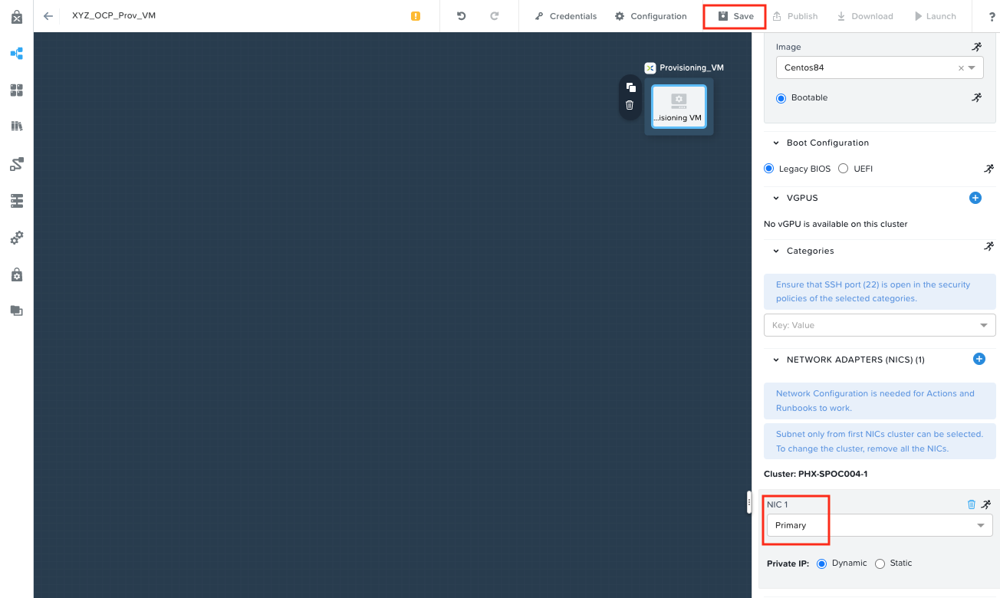
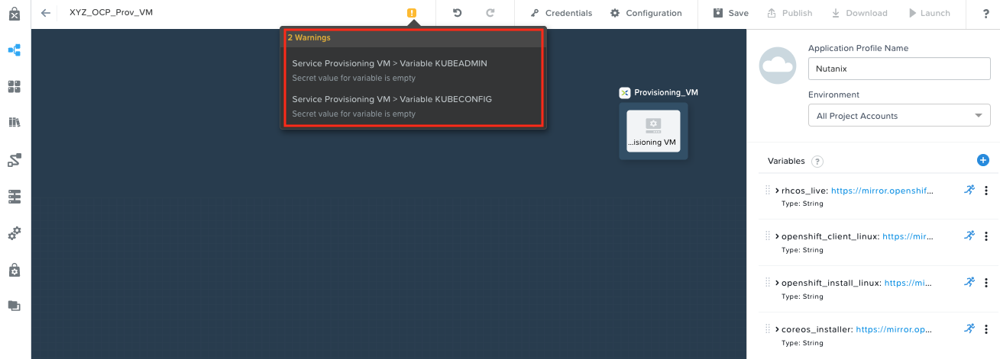
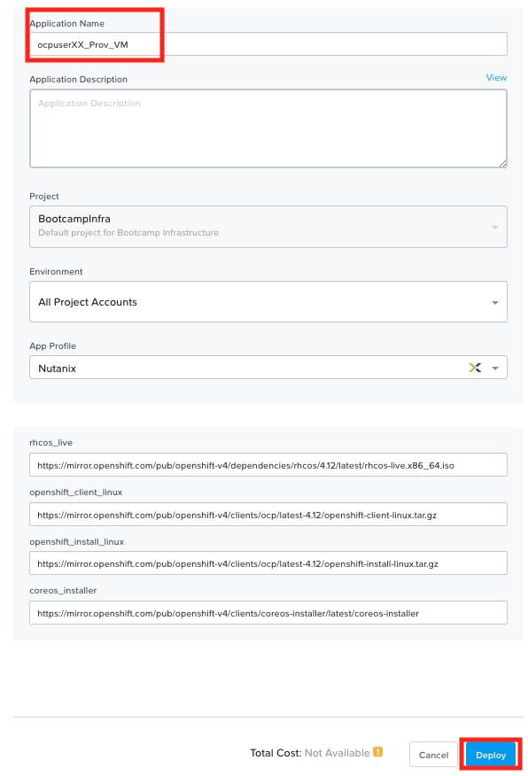

## Configure Provisioning VM Blueprint

Before you proceed with the creating the Provisioning VM, you will need a SSH key pair

```mdx-code-block
<details>
<summary>Instructions to create SSH key pair</summary>
<div>
<body>
```
Logon to your UserXX-LinuxToolsVM
- Username -
``` bash
ssh-keygen -t rsa -b 2048 -f ~/.ssh/ocp   # << accept all default answers
ls -l ~/.ssh/
## Output here
~/.ssh/ocp.pub  
~/.ssh/ocp      # << use this private key in the blueprints
```
```mdx-code-block
</body>
</div>
</details>
```

Now lets configure and deploy Provisioning VM:

1.  In **Prism Central** > **Services** > **Calm**

2.  Click on **Blueprints**

    :::warning
  
    Make sure that you only edit the blueprints you uploaded with your intials. There could be other users using the same HPOC cluster and working on similar blueprints.

    :::

3.  Select your Provisioning VM `ocpuserXX_OCP_Prov_VM` blueprint

We need to configure network and credentials for the blueprint so it can be deployed in your HPOC/SPOC.

1.  Select the Provisioning_VM service
   
2.  Under Cluster, select your assigned HPOC cluster (E.g. PHX-POCXXX)

3.  In the Provisioning_VM service's VM properties, Choose **Primary** as the NIC 1

    

4.  Click on **Save**

5.  Click on **Credentials** (next to **Save**)

6.  Copy and paste the private key (`~/.ssh/ocp`) that created earlier here 

7.  Click on **Save**

8.  Click on **Back** to return to the blueprints main window

9.  You will notice a few warnings for KUBEADMIN and KUBECONFIG
    variables. These can be ignored as they will be auto-generated.

    

## Launch Provisioning VM Blueprint

Now it is time to launch the provisioning VM blueprint.

1.  Click on **Launch** button

2.  Give the application a name **ocpuserXX_Prov_VM** (E.g ocpuser01_Prov_VM)

    

3.  Click on **Deploy**

4.  Go to Audit and monitor the deployment tasks. There will be detailed
    logging for all tasks

5.  This should take about 10-15 minutes

6.  Once deployed the Calm application will be in a running state

    

    ```mdx-code-block
    <details>
    <summary>Curious about what is happening inside the provisioning VM?</summary>
    <div>
    <body>
    ```
    You are able to ssh into the provisioning
    VM using the NCM/Calm **Application** page  > **Services** > **Open Terminal**
    
    
    
    ```zsh
    [core@Openshift-provisioning-0-211225-210356 ~]$ ls -lRh openshift/
    openshift/:
    total 1.6G
    -rw-rw-r--. 1 core   core   7.3M Dec 26 05:11 coreos-installer
    -rwxr-xr-x. 2 core   core   118M Nov  4 19:41 kubectl
    -rwxr-xr-x. 2 core   core   118M Nov  4 19:41 oc
    -rwxr-xr-x. 1 core   core   369M Nov 22 17:12 openshift-install
    -rw-r--r--. 1 core   core    954 Nov  4 19:41 README.md
    -rw-rw-r--. 1 core   core   988M Dec 26 05:12 rhcos-live.x86_64.iso ## << this is RHCOS ISO
    drwxrwxr-x. 2 apache apache  105 Dec 26 05:12 web
    
    openshift/web:
    total 144M
    -rw-rw-r--. 1 apache apache 7.3M Dec 26 05:12 coreos-installer 
    -rw-rw-r--. 1 apache apache  48M Dec 26 05:11 openshift-client-linux.tar.gz ## << this is OCP Client
    -rw-rw-r--. 1 apache apache  89M Dec 26 05:11 openshift-install-linux.tar.gz ## << this is OCP Server
    ```
    ```mdx-code-block
    </body>
    </div>
    </details>
    ```
    
Now we have the provisioning VM up and running. This section of the lab is done.


We will proceed to deploy a OCP cluster in the next section of the lab.
