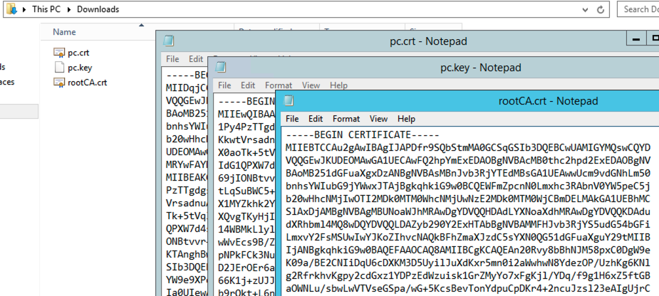
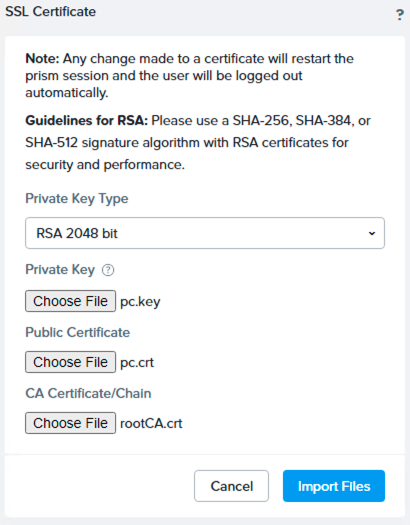
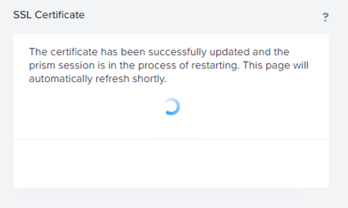
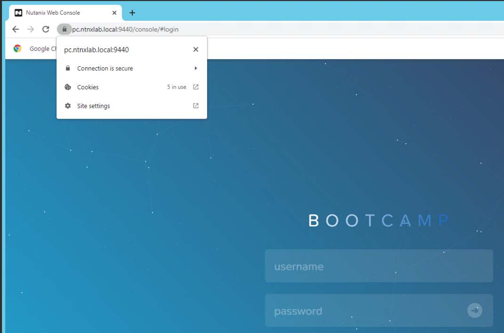

import Tabs from '@theme/Tabs';
import TabItem from '@theme/TabItem';


## Preparing Pre-requisites

We will be deploying OCP cluster using IPI method once the following pre-requisites are met. Be sure to make sure all pre-requisites are prepared.

### Preparing your HPOC cluster

:::caution Do you have enough compute resources?

We have planned enough resources in Nutanix cluster for you to deploy OCP cluster and workloads as well. 

For latest OCP resource requirements refer to OpenShift portal [here.](https://docs.openshift.com/container-platform/4.9/installing/installing_platform_agnostic/installing-platform-agnostic.html#installation-minimum-resource-requirements_installing-platform-agnostic)

At the time of writing this document the following resources are created by OCP IPI installer.
  
| OCP Role   |    Operating System    |    vCPU    |  RAM         | Storage   |         
| -------------|  ---------------------- |  -------- | ----------- |  --------- |  
| Master   x 3     |  RHCOS                 |  8        | 16 GB      |  120 GB   | 
| Worker    x 2   |  RHCOS, RHEL 7.9, or RHEL 8.4  |  4  |  16 GB      |  120 GB | 
| Provisioner    x 1  |  CentOS  |  4  |  8 GB      |  40 GB | 

> Additional space for bootstrap vms (deleted after install) and RHCOS image files are also accounted for.

:::

### AHV Networking 

We will first find two IPs for OCP ``api`` and ``apps`` ingress endpoints in our network and add it to the **Primary** IPAM network blacklist. 

1. Find the CIDR range for your  **Primary** IPAM network either from [RX](https://rx.corp.nutanix.com/) or from your instrutor

   ```buttonless title="CIDR example for your Nutanix cluster"
   10.38.18.192/26
   ```

2. Logon to your UserXX-LinuxToolsVM (deployed on the HPOC cluster) using Mac Terminal or Windows Putty 

   > **Username**: root

   > **Password**: nutanix default 

3. Find two unused static IP addresses

   ```bash
   nmap -v -sn  <your CIDR>
   ```
   ```bash title="Sample command"
   nmap -v -sn 10.38.18.192/26

   ```
   ```buttonless {1,2} title="Sample output - choose the first two consecutive IPs"
   Nmap scan report for 10.38.18.219 [host down] 
   Nmap scan report for 10.38.18.220 [host down]
   Nmap scan report for 10.38.18.221
   Host is up (-0.098s latency).
   ```

4. Logon to any CVM in your cluster and execute the following to add chosen static IPs to the **Primary** IPAM network

   - Username: nutanix
   - Password: your cluster password 
   
   ```bash
   acli net.add_to_ip_blacklist <your-ipam-ahv-network> ip_list=10.38.18.219,10.38.18.220
   ```
   ```bash title="Sample command"
   acli net.add_to_ip_blacklist Primary ip_list=10.38.18.219,10.38.18.220
   ```

### Add DNS Records

In this section we will add PC, API and APPS Ingress DNS records for lookup by OCP IPI installer.

Your OCP cluster's name becomes a subdomain in your DNS zone ``ntnxlab.local``. All OCP cluster related lookups are located within subdomain.

- Main domain -  ``ntnxlab.local`` (this gets created with your HPOC reservation)
  - Sub domain - ``ocpuserXX.ntnxlab.local`` (e.g. ocpuser01, ocpuser02, etc, is your OCP cluster's name)

1. Logon to the AutoAD windows VM 

   > **Username**: administrator

   > **Password**: default

2. We will add the following entries to DNS server using the two consecutive IPs you found in the previous section
   
   :::danger Use your assigned HPOC cluster's IP Addresses

   The IP addresses in the following commands are used as an example. You should use IP address details that belong to your HPOC cluster. 
   
   For information on locating your cluster IP see [Lookup](https://lookup.howntnx.win) website.
   
   :::
   
   ```buttonless
   10.38.18.219   api.ocpuserXX.ntnxlab.local
   10.38.18.220   *.apps.ocpuserXX.ntnxlab.local
   10.38.18.201   pc.ntnxlab.local
   ```

2. Open PowerShell as Administrator and create the two A records

    ```mdx-code-block
    <Tabs>
    <TabItem value="Template commands">
    ```
    ```PowerShell title="Add the API A record - use your own subdomain"
    Add-DnsServerResourceRecordA -Name api.<ocpuserXX> -IPv4Address <your API IP> -ZoneName ntnxlab.local -ZoneScope ntnxlab.local
    ```
    ```PowerShell title="Add the apps Ingress A record - use your own subdomain"
    Add-DnsServerResourceRecordA -Name *.apps.<ocpuserXX> -IPv4Address <your Ingress IP> -ZoneName ntnxlab.local -ZoneScope ntnxlab.local 
    ```
    ```PowerShell title="Add the Prism Central A record"
    Add-DnsServerResourceRecordA -Name pc -IPv4Address <your PC IP> -ZoneName ntnxlab.local -ZoneScope ntnxlab.local 
    ```
    ```mdx-code-block
    </TabItem>
    <TabItem value="Sample commands">
    ``` 
    ```buttonless title="Sample commands with 'ocpuser01' as a subdomain and your OCP cluster name"
    Add-DnsServerResourceRecordA -Name api.ocpuser01 -IPv4Address 10.38.18.219 -ZoneName ntnxlab.local -ZoneScope ntnxlab.local
    Add-DnsServerResourceRecordA -Name *.apps.ocpuser01 -IPv4Address 10.38.18.220 -ZoneName ntnxlab.local -ZoneScope ntnxlab.local 
    ```
    ```PowerShell title="Add the Prism Central A record"
    Add-DnsServerResourceRecordA -Name pc -IPv4Address 10.38.18.201 -ZoneName ntnxlab.local -ZoneScope ntnxlab.local
    ```
    ```mdx-code-block
    </TabItem>
    </Tabs>
    ```

3. Test name resolution for added entries

   ```PowerShell {6}
   nslookup api.ocpuser01.ntnxlab.local
   Server: dc.ntnxlab.local
   Address: 10.38.18.203

   Name: api.ocpuser01.ntnxlab.local
   Address: 10.38.18.219 
   ```
   ```bash {6}
   nslookup myapp.apps.ocpuser01.ntnxlab.local
   Server: dc.ntnxlab.local
   Address: 10.38.18.203

   Name: myapp.apps.ocpuser01.ntnxlab.local
   Address: 10.38.18.220
   ```
   ```bash {6}
   nslookup pc.ntnxlab.local
   Server: dc.ntnxlab.local
   Address: 10.38.18.203

   Name: pc.ntnxlab.local
   Address: 10.38.3.201
   ```

### Downloading OCP Pull Secret

1. Go to the [IPI Installer Web Console](https://console.redhat.com/openshift/install/nutanix/installer-provisioned) and click on **Copy pull secret** button

2. If necessary, paste the pull secret value in a file and save the file to avoid going back to Red Hat Console or dealing with timeouts. 

### Creating and Installing SSL Certificate on Prism Central

:::note

**Skip** this section if you already have a SSL certificate with the following SAN attributes installed on the Prism Central server:

- FQDN of the Prism Central
- IP address of Prism Central 
  
Use either the FQDN or the IP address present in the SSL certificate during the installation process.

:::

```mdx-code-block
<details>
<summary>Create and Install SSL Certificate on Prism Central</summary>
<div>
<body>
```

In this section we will do the following:

- Create a Root CA on your UserXX-LinuxToolsVM (or any Linux VM)
- Create a Certificate Signing Request (CSR) for Prism Central 
- Sign the CSR using Root CA's private key
- Install the resulting certficate on Prism Central
- Verifying installed certificate

All this will be done on the UserXX-LinuxToolsVM or any Linux VM

#### Create a Root CA on your UserXX-LinuxToolsVM

1. In the UserXX-LinuxToolsVM, Create a the Root CA certificates

   ```bash
   openssl genrsa -out rootCA.key 2048
   openssl req -x509 -new -nodes -key rootCA.key -sha256 -days 1024 -out rootCA.crt
   ```
   ```bash title="Execution example - make sure to retype the input values as shown here"
   openssl req -x509 -new -nodes -key rootCA.key -sha256 -days 1024 -out rootCA.crt
   ##
   You are about to be asked to enter information that will be incorporated
   into your certificate request.
   What you are about to enter is what is called a Distinguished Name or a DN.
   There are quite a few fields but you can leave some blank
   For some fields there will be a default value,
   If you enter '.', the field will be left blank.
   -----
   Country Name (2 letter code) [XX]:JP
   State or Province Name (full name) []:Chiba
   Locality Name (eg, city) [Default City]:Kashiwa
   Organization Name (eg, company) [Default Company Ltd]:nutanix
   Organizational Unit Name (eg, section) []:rootca
   Common Name (eg, your name or your server's hostname) []:rootca.ntnxlab.local
   Email Address []:first.last@nutanix.com
   ```

#### Create a Certificate Signing Request (CSR) for Prism Central 

2. Create a configuration file for Prism Central's certificate parameters 

   ```bash
   cat << EOF > pc.conf
   [ req ]
   default_bits    = 2048
   distinguished_name = req_distinguished_name
   req_extensions   = req_ext
   [ req_distinguished_name ]
   countryName     = Country Name (2 letter code)
   stateOrProvinceName = State or Province Name
   localityName    = Locality Name
   organizationName  = Organization Name
   organizationName_default = pc
   commonName     = Common Name
   commonName_default     = ntnxlab.local
   [ req_ext ]
   subjectAltName = @alt_names
   [alt_names]
   DNS.1  = pc.ntnxlab.local
   EOF
   ```
3. Create the private key and CSR for Prism Central
  
   ```bash
   openssl genrsa -out pc.key 2048
   openssl req -new -sha256  -key pc.key -config ./pc.conf -out pc.csr
   ```
   ```bash title="Execution example - make sure to retype the input values as shown here"
   openssl req -new -sha256  -key pc.key -config ./pc.conf -out pc.csr
   You are about to be asked to enter information that will be incorporated
   into your certificate request.
   What you are about to enter is what is called a Distinguished Name or a DN.
   There are quite a few fields but you can leave some blank
   For some fields there will be a default value,
   If you enter '.', the field will be left blank.
   -----
   Country Name (2 letter code) []:JP
   State or Province Name []:Chiba
   Locality Name []:Kashiwa
   Organization Name [pc]:pc
   Common Name [ntnxlab.local]:ntnxlab.local
   ```

4. Check your Prism Central's DNS alternative names in the CSR you created

   ```bash
   openssl req -noout -text -in pc.csr | grep DNS
   ```
   ```bash title="Output"
   DNS:pc.ntnxlab.local
   ```

5. Create a file called pctext to store the DNS/SAN names

   ```bash
   echo "subjectAltName = DNS:pc.ntnxlab.local" >> pctext
   ```
#### Sign the CSR using Root CA's private key

6. Sign the CSR using rootCA's private key and produce a certificate for Prism Central

   ```bash
   openssl x509 -req -in pc.csr -CA rootCA.crt -CAkey rootCA.key -CAcreateserial -out pc.crt -days 1024 -sha256 -extfile pctext
   ```

7. List the contents of the directory to make sure pc.crt, pc.key and rootCA.crt files are present

   ```bash
   ls -l *.crt *.key | awk '{print $9}'
   ```
   ```bash title="Output"
   pc.crt               ## Prism Central's public certificate signed by Root CA
   pc.key               ## Prism Central's private key
   rootCA.crt           ## Root CA's public certificate
   rootCA.key           ## Root CA's private key
   ```
   
8. ``cat`` out the contents of ``rootCA.crt``, ``pc.key`` and ``pc.crt`` and copy them to the UserXX-WindowsToolsPC in separate files

   ```buttonless
   cat rootCA.crt
   cat pc.key
   cat pc.crt
   ```

#### Install the resulting certificate on Prism Central

9. In UserXX-WindowsToolsPC (or any workstation), use Notepad to create three new files with the same names

10. Copy the output of previous cat command of ``rootCA.crt``, ``pc.key`` and ``pc.crt`` files into to your UserXX-WindowsToolsPC VM or any workstation where you will be installing this certficate from. 
    
   

11. Logon to Prism Central Web GUI on the WindowsToolsVM

   ```url
   https://pc.ntnxlab.local/
   ```

12. Go to **Settings > SSL Certificate**

13. Click on **Replace Certificate** 

14. Select **Import Key and Certificate**

15. Click **Next**

16. Choose the following:
    
    > **Private Key Type** - RSA 2048 bit 
    
    > **Private Key** - ``pc.key``
   
    > **Public Certificate** - ``pc.crt``
    
    > **CA Certificate/Chain** - ``rootCA.crt``

17. Click on **Import Files**

    

18. Prism Central GUI will accept the certificate and restart for the changes to take effect. 

    

    You have now successfully installed SSL certificate on Prism Central.

    :::caution

    Do not proceed to the next steps until Prism Central Certificate is installed without errors. 

    Contact your lab instructors if you need help with troubleshooting SSL certificate issues.

    :::

#### Verifying Installed Certificate - Optional

19. To make sure that the WindowsToolsPC has the rootCA certificate installed in the local, double click on the ``rootCA.crt`` file in windows file explorer and select **install Certificate**

    

20. Choose **Local Machine** as Store Location and click **Next**

21. Choose **Place all certificates in the following store** and click **Browse**

22. Choose **Trusted Root Certification Authorities** and click **Next**

23. Click on **Finish**

24. You will notice that the browser has no warning about about an untrusted PC site 
     
    :::tip
    You may need to restart your browser if this isn't showing as a trusted site.
    :::

    

    You have completed the configuring SSL certificate pre-requisites for IPI installation. 

```mdx-code-block
</body>
</div>
</details>
```

### Prism Central Pre-requisites

Enable the following in PC if not already enabled.

#### Projects
1. In PC dashboard, choose **Apps and Marketplace** from the top-left-hand-side drop-down menu
2. Click on **Projects** 
3. Click on **+Create Project**


#### Marketplace
1. In PC dashboard, choose **Apps and Marketplace** from the top-left-hand-side drop-down menu
    
   
   
2. Click on **Marketplace** 
3. Click on **Enable Marketplace**. This may take up to 10 minutes
   
   


   
Now that we have all pre-requisites completed, let us move on to creating the OCP cluster