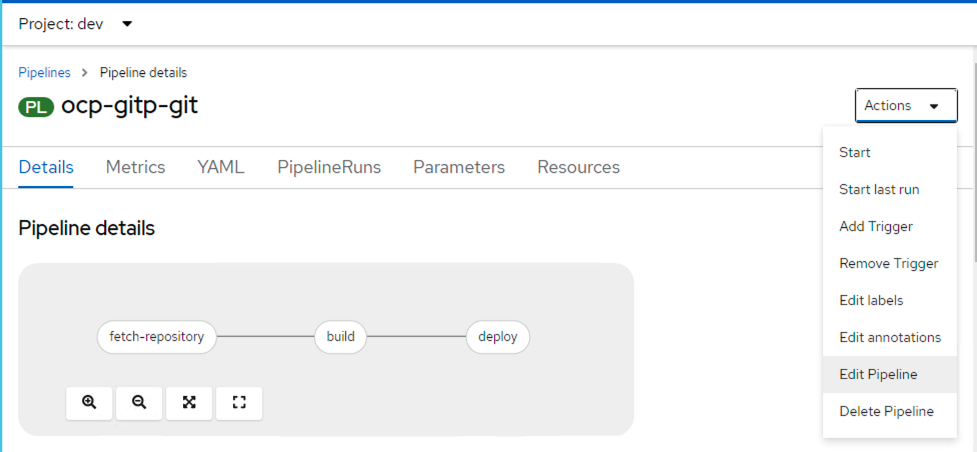
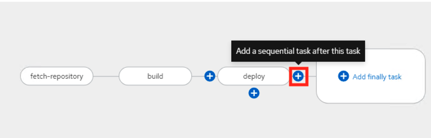
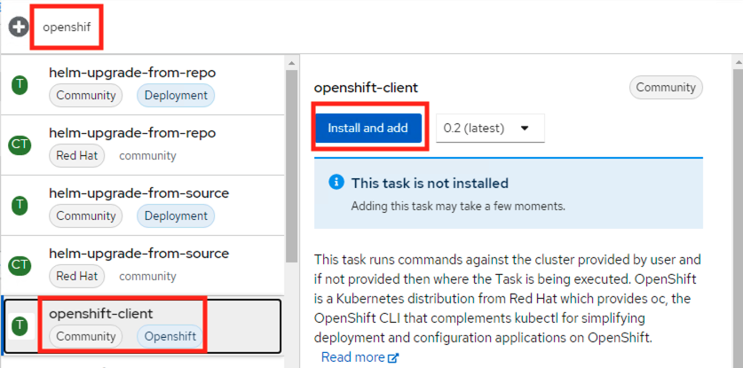
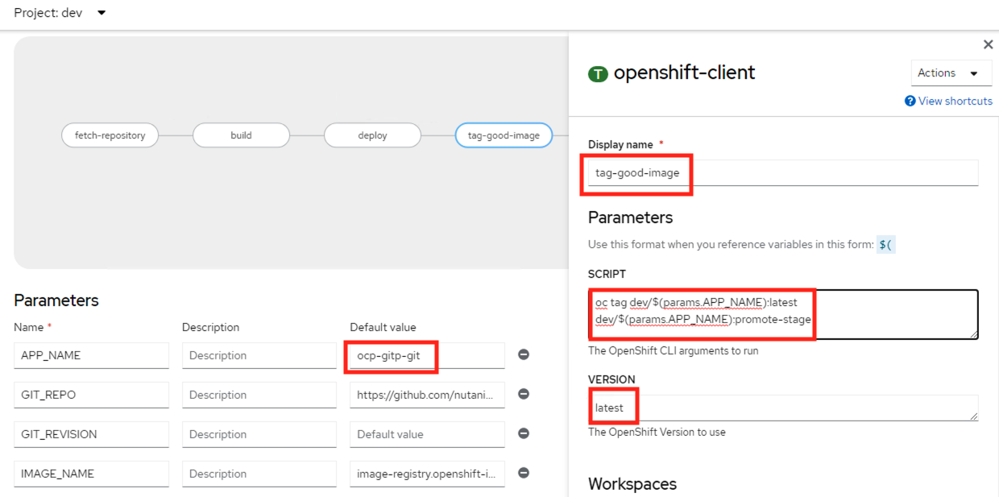
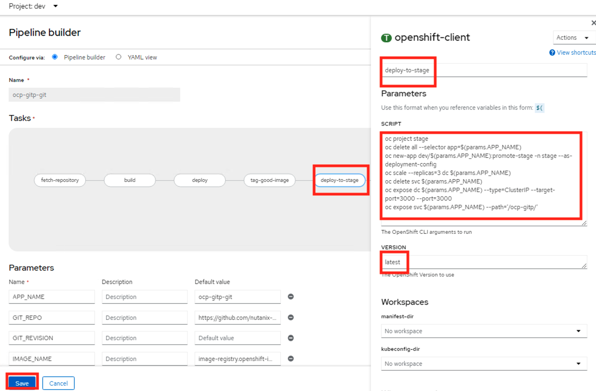
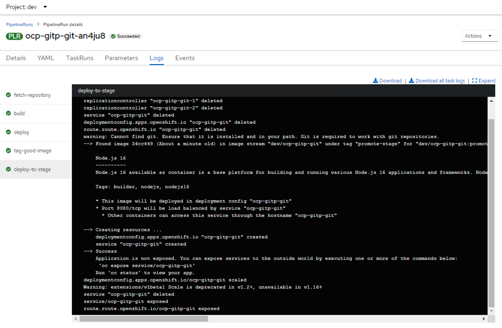
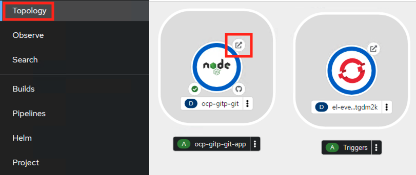
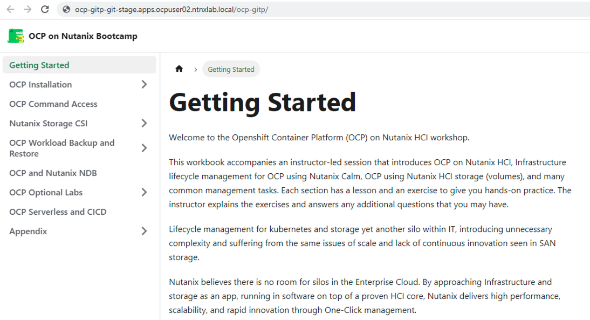

import Tabs from '@theme/Tabs';
import TabItem from '@theme/TabItem';

## Deployment Scenario

So far we have seen how to build and deploy an application using pipelines and serverless functionality. Now let us get into day-to-day life of a DevOps engineer or a Developer who needs to automate the following workflow.

1. Build a container image from the source git repository
2. Deploy the image into development environment 
3. If the deployment is successful, then tag the image as ready for staging
4. Deploy the ready-for-staging to staging environment

Lucky for us, as we have the pipelines operator (implemented using [Tekton](https://tekton.dev)), and serverless functionality using S2I, we can automate all this OCP and most other Kubernetes distribution (with a little know-how).

### Build and Test in Development 

Let us extend our previously built ``ocp-gitp-git`` pipeline.

1. Browse to you OCP cluster's web UI

   ```url
   https://console-openshift-console.apps.ocpuserXX.ntnxlab.local/
   ```
2. Login as kubeadmin or a IDP user

3. Switch to Developer view
   
4. Make sure you are under `dev` project 
   
5. Click on **Pipelines** option and then click on **ocp-gitp-git** pipeline
   
6. In the **Actions** menu, click on **Edit Pipeline**
   
   

7. Select the ``deploy`` step and click on the ``+`` mark next to it, to add a sequential task
   
   

8. A new task will appear and join the pipeline 
9. Click on the **Add task** and in the search text box type ``openshift``
10. Select this, click on **Add and install**
   
   

11. On the right-hand side the task property window will open 
12. Enter the following fields:
    
    - **Display name (for task)** - tag-good-image
    - **SCRIPT** - copy and paste the following script
      
      ```bash title="Paste this without altering"
      oc tag dev/$(params.APP_NAME):latest dev/$(params.APP_NAME):promote-stage
      ```
    - **VERSION** - latest (we are configuring to use the latest version of `OC` command)

    

    :::tip

    We will be using `$(PARAMS.APP_NAME)`variable's value (populated from when you created the pipeline) as the APP_NAME as it keeps things uniform. You can think of various use cases for variables/parameters.

###  Deploy in Staging 

Now that we have built and deployed image in development `dev` namespace. We can proceed to deploy in staging namespace.

We will do things a little different this time:

- Use the image that was successfully deployed in staging namespace and tagged to be promoted to staging ``:promote-stage``
- Increase the number of replicas to 3 as number of users testing will also increase 

Let's do this!

1.  Follow the same steps as above to add another task and fill the following fields:
    
    - **Display name (for task)** - deploy-to-stage
    - **SCRIPT** - copy and paste the following script
      
      ```bash title="Paste this without altering"
      oc project stage
      oc delete all --selector app=$(params.APP_NAME)
      oc new-app dev/$(params.APP_NAME):promote-stage -n stage --as-deployment-config
      oc scale --replicas=3 dc $(params.APP_NAME)
      oc delete svc $(params.APP_NAME)
      oc expose dc $(params.APP_NAME) --type=ClusterIP --target-port=3000 --port=3000
      oc expose svc $(params.APP_NAME) --path='/'
      ```
    - **VERSION** - latest  

    

    ```mdx-code-block
    <details>
    <summary>Curious about Tekton pipeline?</summary>
    <div>
    <body>
    ```
    If you would like to see a yaml view of the pipeline you just created:
     
    1. Select your ``ocp-gitp-git`` pipeline
    2. Click on **YAML** tab

    ```yaml title="Note the params, tasks and workspaces"
    apiVersion: tekton.dev/v1
    kind: Pipeline
    metadata:
      creationTimestamp: '2025-05-27T05:58:03Z'
      generation: 2
      labels:
        app.kubernetes.io/instance: ocp-gitp-git
        app.kubernetes.io/name: ocp-gitp-git
        operator.tekton.dev/operand-name: openshift-pipelines-addons
        pipeline.openshift.io/runtime: nodejs
        pipeline.openshift.io/runtime-version: 20-minimal-ubi8
        pipeline.openshift.io/type: kubernetes
      managedFields:
        - apiVersion: tekton.dev/v1
          fieldsType: FieldsV1
          fieldsV1:
            'f:metadata':
              'f:labels':
                .: {}
                'f:app.kubernetes.io/instance': {}
                'f:app.kubernetes.io/name': {}
                'f:operator.tekton.dev/operand-name': {}
                'f:pipeline.openshift.io/runtime': {}
                'f:pipeline.openshift.io/runtime-version': {}
                'f:pipeline.openshift.io/type': {}
            'f:spec':
              .: {}
              'f:finally': {}
              'f:params': {}
              'f:tasks': {}
              'f:workspaces': {}
          manager: Mozilla
          operation: Update
          time: '2025-05-27T06:39:08Z'
      name: ocp-gitp-git
      namespace: dev
      resourceVersion: '347269'
      uid: 9e12fac5-19fa-4a13-be7c-93505503a3f5
    spec:
      params:
        - default: ocp-gitp-git
          name: APP_NAME
          type: string
        - default: 'https://github.com/ariesbabu/ocp-gitp.git'
          name: GIT_REPO
          type: string
        - name: GIT_REVISION
          type: string
        - default: 'image-registry.openshift-image-registry.svc:5000/dev/ocp-gitp-git'
          name: IMAGE_NAME
          type: string
        - default: .
          name: PATH_CONTEXT
          type: string
        - default: 20-minimal-ubi8
          name: VERSION
          type: string
      tasks:
        - name: fetch-repository
          params:
            - name: URL
              value: $(params.GIT_REPO)
            - name: REVISION
              value: $(params.GIT_REVISION)
            - name: SUBDIRECTORY
              value: ''
            - name: DELETE_EXISTING
              value: 'true'
          taskRef:
            params:
              - name: kind
                value: task
              - name: name
                value: git-clone
              - name: namespace
                value: openshift-pipelines
            resolver: cluster
          workspaces:
            - name: output
              workspace: workspace
        - name: build
          params:
            - name: IMAGE
              value: $(params.IMAGE_NAME)
            - name: TLS_VERIFY
              value: 'false'
            - name: CONTEXT
              value: $(params.PATH_CONTEXT)
            - name: VERSION
              value: $(params.VERSION)
          runAfter:
            - fetch-repository
          taskRef:
            params:
              - name: kind
                value: task
              - name: name
                value: s2i-nodejs
              - name: namespace
                value: openshift-pipelines
            resolver: cluster
          workspaces:
            - name: source
              workspace: workspace
        - name: deploy
          params:
            - name: SCRIPT
              value: oc rollout status deploy/$(params.APP_NAME)
          runAfter:
            - build
          taskRef:
            params:
              - name: kind
                value: task
              - name: name
                value: openshift-client
              - name: namespace
                value: openshift-pipelines
            resolver: cluster
        - name: tag-good-name
          params:
            - name: SCRIPT
              value: 'oc tag dev/$(params.APP_NAME):latest dev/$(params.APP_NAME):promote-stage'
            - name: VERSION
              value: latest
          runAfter:
            - deploy
          taskRef:
            kind: Task
            name: openshift-client
        - name: deploy-to-stage
          params:
            - name: SCRIPT
              value: |-
                oc project stage
                oc delete all --selector app=$(params.APP_NAME)
                oc new-app dev/$(params.APP_NAME):promote-stage -n stage --as-deployment-config
                oc scale --replicas=3 dc $(params.APP_NAME)
                oc delete svc $(params.APP_NAME)
                oc expose dc $(params.APP_NAME) --type=ClusterIP --target-port=3000 --port=3000
                oc expose svc $(params.APP_NAME) --path='/'
            - name: VERSION
              value: '4.7'
          runAfter:
            - tag-good-name
          taskRef:
            kind: Task
            name: openshift-client
      workspaces:
        - name: workspace
    ```
    ```mdx-code-block
    </body>
    </div>
    </details>
    ```
    
   
2.  Click on **Save** 
    
3.  Go to **Actions** menu, and click on **Start**
   
4.  Type ``main`` as git revision if prompted
    
4.  Monitor the run in the PipelineRuns tab, and you should be able to monitor the pipeline run
    
    

    Make sure the pipeline run is successful, if there issues, troubleshoot and fix before moving on.

5.  Optional - Using ``oc`` command line, run the following commands to confirm the presence of resources in stage namespace/project
     
    ```mdx-code-block
    <Tabs>
    <TabItem value="Command">
    ```
    ```bash
    oc get all -n stage
    ```
    ```mdx-code-block
    </TabItem>
    <TabItem value="Command and output">
    ``` 
    ```bash
    oc get all -n stage
    #
    NAME                        READY   STATUS      RESTARTS   AGE
    pod/ocp-gitp-git-1-929g7    1/1     Running     0          90m
    pod/ocp-gitp-git-1-deploy   0/1     Completed   0          90m
    pod/ocp-gitp-git-1-gp478    1/1     Running     0          90m
    pod/ocp-gitp-git-1-wmq88    1/1     Running     0          90m
    
    NAME                                   DESIRED   CURRENT   READY   AGE
    replicationcontroller/ocp-gitp-git-1   3         3         3       90m
    
    NAME                   TYPE        CLUSTER-IP       EXTERNAL-IP   PORT(S)    AGE
    service/ocp-gitp-git   ClusterIP   172.30.165.192   <none>        3000/TCP   90m
    
    NAME                                              REVISION   DESIRED   CURRENT   TRIGGERED BY
    deploymentconfig.apps.openshift.io/ocp-gitp-git   1          3         3         config,image(ocp-gitp-git:promote-stage)
    
    NAME                                    HOST/PORT                                           PATH         SERVICES       PORT   TERMINATION   WILDCARD
    route.route.openshift.io/ocp-gitp-git   ocp-gitp-git-stage.apps.ocp-cluster.ntnxlab.local   /ocp-gitp/   ocp-gitp-git   3000                 None
    ```
    ```mdx-code-block
    </TabItem>
    </Tabs>
    ```

6.  Click on **Topology** option, and click on the URL on your application as shown here, this is a route created by the pipeline for application access
    
    
    
    The application should open in a new browser tab

    
    
    :::note 

    Note that the documentation site NodeJS application is now hosted on your OCP cluster

    ```url
    http://ocp-gitp-git-stage.apps.user02.ntnxlab.local/
    ```
    Where:

    - `ocp-gitp-git` - is your application name
    - `stage` - is your namespace/project name
    - `ocpuser02` - is your OCP cluster
    - `ntnxlab.local` - is your domain
    - `/ocp-gitp/` - is your basePath url

    :::

You can note how easy it is build pipelines to automate your deployments using serverless and CICD.
