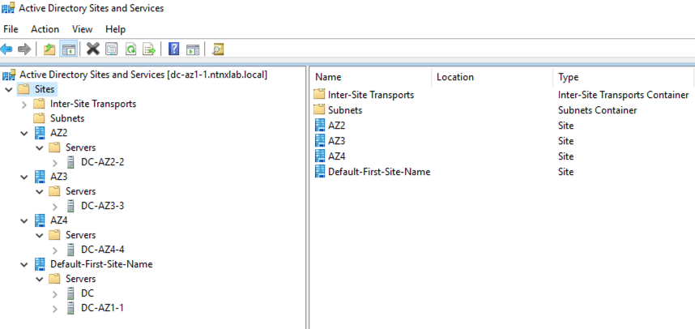
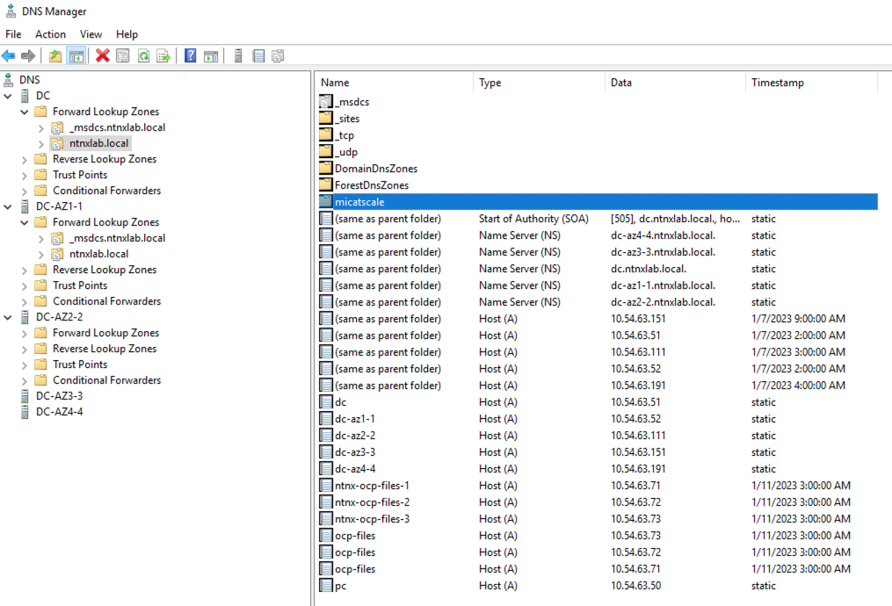

# IDP and DNS Implementation

## Design Overview

In this section we will look at design decisions that has driven IDP and DNS design.

One of the primary requirements is to deploy IDP and DNS across multiple Availability Zones (AZ) to tolerate failure. This IDP and DNS services will be used by the OCP cluster and  workloads hosted on it. 

Other requirements could be the following:

- Local storage availability
- IDP and DNS information to replicate across AZ
- Failure of any one AZ will start automated failover of IDP and DNS

:::note

We will not be using Active Directory Federation Services in an attempt to keep the implementation simple. However, please feel free to deploy it if necessary. 

:::

We will look at deploying a inter-AZ infrastructure services.

These are the high-level steps we will go through in this section:

1. Install 2 x Microsoft AD and DNS servers in AZ1 
   - One Primary AD DNS (DM3-POC009)
   - One additional AD DNS (DM3-POC009)
2. Install 3 x additional AD and DNS server in AZ2, AZ3 and AZ3 to provide redundancy
   - One additional AD DNS (DM3-POC010)
   - One additional AD DNS (DM3-POC011)
   - One additional AD DNS (DM3-POC013)

We will build the following resilient AD(IDP) and DNS implementation.

| Availability Zone (AZ) | Nutanix Cluster |  Role | VM Name| IP Address |
| :---------------------:|:--------------------:|:-------------------:|:-------------------:|:-------------------:|
| AZ 1              |DM3-POC009|Primary DC and DNS | DC |10.54.63.51|
| AZ 1              |DM3-POC009|Additional DC and DNS | DC-AZ1-1 |10.54.63.52|
| AZ 2               |DM3-POC010|Additional DC and DNS |DC-AZ2-2 |10.54.63.111|
| AZ 3             |DM3-POC011|Additional DC and DNS|DC-AZ3-3|10.54.63.151|
| AZ 4           |DM3-POC013| Additional DC and DNS|DC-AZ4-4|10.54.63.191|


## Pre-requisites

You will need the following pre-requisites:

- Access to Windows server OS image 
- Basic Windows roles and features installation knowledge
- 5x Static IPs chosen for 4 AD+DNS VMs 
  
## IDP and DNS Implementation

Since you will potentially build this environment using a HPOC/SPOC, we will use the Windows OS images in our DFS share to build these VMs.

### Upload Images

1. Go to **Prism Central** 
2. In the search window (on top left), enter the text **Images**
3. Choose the Images option and Click on **Add Image**
4. Select URL and enter the following [AutoAD](http://10.42.194.11/workshop_staging/autoad.qcow2) (right-click and copy URL)
5. Paste the URL in the **Enter Image URL** text box
6. Click on **Upload File**
7. Click on **Next**
8. Choose **Place image directly on clusters**
9. Select all your three or four clusters (this design uses four clusters) each representing different AZs.
10. Click on **Save**
11. Monitor the progress in the background and make sure the images are available in all four clusters in the three AZ. 

Repeat these steps to upload [Windows2019](http://10.42.194.11/workshop_staging/Windows2019.qcow2) (right-click and copy URL) image for the additional domain controllers.

### Create Primary AD and DNS VM

1. In **Prism Central** > select **Menu** > **Compute and Storage > VMs**, and click **Create VM**

1.  Fill out the following fields:
    -   **Name** - DC-AZ1-0
    -   **Description** - (Optional) Description for your VM.
    -   **Cluster** - Choose the AZ1 cluster (DM3-POC009)
    -   **Number of VMs** - 1
    -   **CPU(s)** - 4
    -   **Number of Cores per CPU** - 1
    -   **Memory** - 4 GiB
2.  Click **Next**
3.  Under **Disks** select **Attach Disk**
    -   **Type** - DISK
    -   **Operation** - Clone from Image
    -   **Image** - autoad.qcow2
    -   **Capacity** - leave at default size
    -   **Bus Type** - leave at default SCSI Setting
4.  Click **Save**
5.  Under **Networks** select **Attach to Subnet**
    -   **VLAN Name** - Primary
    -   **Network Connection State** - Connected
    -   **Assignment Type** - Assign a static IP in your CIDR
6.  Click **Save**
7.  Click **Next** at the bottom
8.  In **Management** section
    -   **Categories** - leave blank
    -   **Timezone** - leave at default UTC
    -   **Guest Customization** - No Customization
9.  Go back to **Prism Central** > **Menu** > **Compute and Storage** > **VMs**
10. Select your *ocpuserXX-Linux-ToolsVM
11. Under **Actions** drop-down menu, choose **Power On**

    :::note
    It may take up to 10 minutes for the VM to be ready.
    
    You can watch the console of the VM from Prism Central to make sure all the sysprep script has finished running.
    :::

12. Login to the VM via SSH or Console session and confirm the presence of following components :
    
    - Active Directory Users and Computers
    - DNS
    - Active Directory Sites and Services

### Prepare AD Sites and Services

We will prepare our Active Directory Sites and Services to reflect our physical AZ.

1. Logon to the primary domain controller
2. Opens Active Directory Sites and Services
3. Create a new site for each AZ as shown in the table below. 
   
<table>
<thead>
  <tr>
    <th>AZ</th>
    <th>AD Site Name</th>
    <th>AD Sever</th>
    <th>Notes</th>
  </tr>
</thead>
<tbody>
  <tr>
    <td rowspan="2">AZ1</td>
    <td rowspan="2">Default First Site</td>
    <td>DC</td>
    <td rowspan="2">This is automatically created with DC install.</td>
  </tr>
  <tr>
    <td>DC-AZ1-1</td>
  </tr>
  <tr>
    <td>AZ2</td>
    <td>AZ2</td>
    <td>DC-AZ2-2</td>
    <td></td>
  </tr>
  <tr>
    <td>AZ3</td>
    <td>AZ3</td>
    <td>DC-AZ3-3</td>
    <td></td>
  </tr>
  <tr>
    <td>AZ4</td>
    <td>AZ4</td>
    <td>DC-AZ4-4</td>
    <td></td>
  </tr>
</tbody>
</table>

Once you have finished creatin the AZ2, AZ3 and AZ4 sites, the console should looks as follows: 

:::note

The primary domain controller is by default a part of **Default-First-Site-Name**.

:::


We can use these sites to deploy our additional domain controllers.

### Implement DNS Best Practices

The following DNS best practices should be implemented in PoC to get a resilient DNS infrastructure.

On your domain controller, configure your network cards static IP and DNS addresses to suit the best practices.

- Round-robin approach to **Preferred DNS Server**-
- Loop back address to **Alternate DNS Server**-
- All other additional DNS servers including public DNS servers in **Addtional DNS Server**

Here is a summation of what the configuration would like like.
<table>
<thead>
  <tr>
    <th>#</th>
    <th>DC Name</th>
    <th>DC IP Address</th>
    <th>Preferred DNS Server</th>
    <th>Alternate DNS Server</th>
    <th>Additional DNS Servers</th>
  </tr>
</thead>
<tbody>
  <tr>
    <td>1</td>
    <td>DC</td>
    <td>10.54.63.51</td>
    <td>10.54.63.51</td>
    <td>127.0.0.1</td>
    <td rowspan="5">10.54.63.51,52,111,151,111,8.8.8.8,8.8.4.4</td>
  </tr>
  <tr>
    <td>2</td>
    <td>DC-AZ1-1</td>
    <td>10.54.63.52</td>
    <td>10.54.63.51</td>
    <td>127.0.0.1</td>
  </tr>
  <tr>
    <td>3</td>
    <td>DC-AZ2-2</td>
    <td>10.54.63.111</td>
    <td>10.54.63.52</td>
    <td>127.0.0.1</td>
  </tr>
  <tr>
    <td>4</td>
    <td>DC-AZ3-3</td>
    <td>10.54.63.151</td>
    <td>10.54.63.111</td>
    <td>127.0.0.1</td>
  </tr>
  <tr>
    <td>5</td>
    <td>DC-AZ4-4</td>
    <td>10.54.63.191</td>
    <td>10.54.63.151</td>
    <td>127.0.0.1</td>
  </tr>
</tbody>
</table>

### Deploy Additional AD and DNS Controllers

In this section we will deploy additional AD and DNS VMs in AZ1, AZ2 and AZ3. 

#### Prepare VM

Deploy an addtional domain controller and DNS VM in AZ1 (DM3-POC009)

Create a VM with the following details:
   
1.  Fill out the following fields:
    -   **Name** - DC-AZ1-1
    -   **Description** - (Optional) Description for your VM.
    -   **Cluster** - Choose the AZ1 cluster (cluster DM3-POC010)
    -   **Number of VMs** - 1
    -   **CPU(s)** - 4
    -   **Number of Cores per CPU** - 1
    -   **Memory** - 4 GiB
2.  Click **Next**
3.  Under **Disks** select **Attach Disk**
    -   **Type** - DISK
    -   **Operation** - Clone from Image
    -   **Image** - Windows2019
    -   **Capacity** - leave at default size
    -   **Bus Type** - leave at default SCSI Setting
4.  Click **Save**
5.  Under **Networks** select **Attach to Subnet**
    -   **VLAN Name** - Primary
    -   **Network Connection State** - Connected
    -   **Assignment Type** - Assign Static IP
    -   **IP Address** - Assign one IP from you reserved CIDR 
6.  Click **Save**
7.  Click **Next** at the bottom  
8.  In **Management** section
    -   **Categories** - leave blank
    -   **Timezone** - leave at default UTC
    -   **Guest Customization** - No Customization
9.  Go back to **Prism Central** > **Menu** > **Compute and Storage** > **VMs**
10. Select your DC-AZ1-01 VM
11. Under **Actions** drop-down menu, choose **Power On**
12. In the welcome screen, set the following: 
    - What's your home country/region? - United States
    - What's your preferred app languages? - English (United States)
    - What keyboard layout would you like to user? - US
13. Click Accept in License terms Window
14. Set a local administrator password
16. Set the static the IP address on the NIC to the following:
    - **IP** - 10.54.63.52
    - **Subnet** - 255.255.255.0
    - **Gateway** - 10.54.63.1
    - **Preferred DNS Server**- 10.54.63.51 (the primary domain controller)
    - **Alternate DNS Server**- 127.0.0.1 (loopback)
15. Set the hostname name to **DC-AZ1-1** (reboot if required)

Repeat these steps to create additional domain controllers in AZ2 (DM3-POC010), AZ3 (DM3-POC011) and AZ4(DM3-POC013). 

#### Install Additional Domain Controller

:::note Reference

We have followed [this](https://activedirectorypro.com/add-secondary-domain-controller/) article to implement additional domain controllers.

:::

1. Open Server Manager
  
2. Select Role-based or featured-based installation and click Next
   
3. Select a server from the server pool. Select your server and click Next
   
4. Select Active Directory Domain Services, you will get a popup to add features that are required for Active Directory Domain Services, click Add features. Click Next
   
5. Click next on the features page. Nothing additional needs to be selected on this page

6. Click next on the AD DS page. This page is just informational

7. Click Install on the confirmation page 

8. Monitor to make sure the installation is complete

9.  In the server manager click the yellow icon at the top and click **Promote this server to a domain controller**
    
10. Select “Add a domain controller to an existing domain”
    
11. Next, enter or select the existing domain (**dc.ntnxlab.local**) you want to add the secondary domain controller to. You will need to click the change button to enter in administrator credentials. Click Next.
    
12. On the Domain Controller Options page, Domain Name System (DNS) server and Global Catalog (GC) should be checked. The **Default First Site Name** should be selected.
     
    :::caution

    While installing additonal domain controllers in AZ2, AZ3 and AZ4, choose the appropriate site you created in AD Sites and Services [](../ocp_topology/infra_topology.md#prepare-ad-sites-and-services) section.

    :::

[](../ocp_topology/infra_topology.md#prepare-ad-sites-and-services)

13. Enter a password for the Directory Services Restore mode and click **Next**
14. Ignore warnings about delegation and click **Next**
15. Accept the defaults for the remainder of the configuration and monitor the installation

**Repeat** these steps for other additional domain controllers in your configuration:

- **AZ2** - DC-AZ2-2
- **AZ3** - DC-AZ3-3
- **AZ4** - DC-AZ4-4
  
Once you have finished adding all other addtional domain controllers and DNS the configuration should look as follows:

**AD**



**DNS**



#### Check Replication Status

Once the additional domain controller is deployed you can check the replciation status. 

1. Open Active Directory Users and Services and check for existance of user records
2. If replication is not complete, open PowerShell and run the following command
    
    ```PowerShell
    repadmin /replsummary
    ```

    :::caution
    
    The lowest setting is 15 minutes. However this can be changed to immediate by configuring the following registry key. Note that this is not recommended in production environment and decision should be made considering the available bandwidth and compute resources for the domain controllers.
    
    [Here](https://www.itgeared.com/modifying-behavior-of-inter-site/) is an article to accomplish this.
    
    :::

