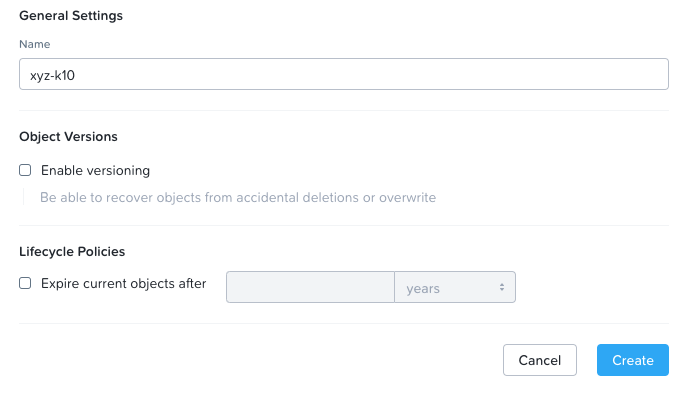
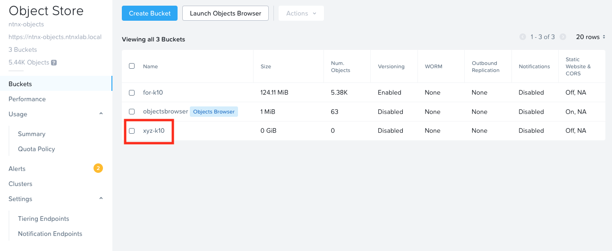

In this section we will setup up Nutanix Objects to serve as a backup destination to backup our wordpress application.

# Generating Access Keys

:::caution

Skip this section if you have already created a Objects user and downloaded the access and secret keys.

For example: ``ocpuserXX`` user from the previous section of the lab could be used here instead of creating a new one.

:::

Generate access keys if you haven't done it already. 

1.  Go to **Prism Central** > **Objects**

2.  Note down the **ntnx-objects** object store's public IP

    

3.  On the top menu, click on **Access Keys**

4.  Click on **+ Add people**

5.  Select **Add people not in a directory service**

6.  Enter your email (ocpuserXX@ntnxlab.local) and name (ocpuserXX) (if you haven't already configured this part)

7.  Click on **Next**

8.  Click on **Generate Keys**

9.  Once generated, click on **Download Keys**

10. Once downloaded, click on **Close**

11. Open the downloaded file to verify contents

    ```bash
    Username: ocpuserXX@ntnxlab.com
    Access Key: t1FzWhILj_CxU4NGNcWzZ0hW-xxxxxxx
    Secret Key: KbGdgYMoaYx1DnIJ6gTgu-xxxxxxxxxx
    Display Name: ocpuserXX
    Tag: buckets-access-key-xxxxxxxxxxxxxxxxxxxx
    ```

# Create Buckets for Backup Destination

We will create a bucket for backup destination

1.  On the top menu, click on **Object Stores**

2.  Click on **ntnx-objects**, this will open objects store management
    page in a separate browser tab

3.  Click on **Create Bucket**

4.  Enter *Initials*-k10 as the bucket name

    

5.  Click on **Create**

6.  In the list of buckets, click on the *Initials*-k10 bucket

    

7.  Click on **User Access** menu and **Edit User Access**

    

8.  In the **Share Bucket xyz-k10** window, type in your email that you configured in User Access section

9.  Give **Full Access** permissions
10. Click on **Save**

You have now provisioned a S3 bucket to store backups of the application which you will deploy in the next section.