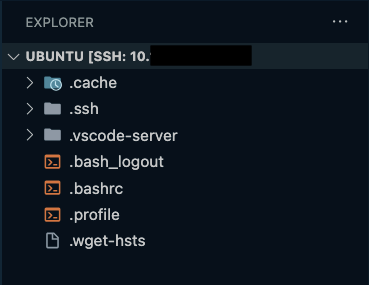

## Overview

This Ubuntu VM image will be staged with packages used to support multiple lab exercises.

Deploy this VM on your assigned cluster if directed to do so as part of **Lab Setup**.


## Upload Linux Tools VM Image

:::caution

Only deploy the image once with your *Initials* in the image name, it does not need to be cleaned up as part of any lab completion.

:::

1. In Prism Central > Select Compute and Storage > Images  
2. Click on Add Image 
3. Select the URL radio button and paste the following image URL
   
   ```bash
   https://cloud-images.ubuntu.com/releases/24.04/release/ubuntu-24.04-server-cloudimg-amd64.img
   ```
4. Click on Upload File and in the description add your *Initials*
5. Click on Next and select Place Image Directly on cluster
6. Click on Save
   
## Deploying Linux Tools VM

:::caution

Only deploy the VM once with your *Initials* in the VM name, it does not need to be cleaned up as part of any lab completion.

:::

1. In **Prism Central** > select **Menu** > **Compute and Storage > VMs**, and click **Create VM**

1.  Fill out the following fields:
    -   **Name** - *Initials*-Linux-ToolsVM
    -   **Description** - (Optional) Description for your VM.
    -   **Number of VMs** - 1
    -   **CPU(s)** - 4
    -   **Number of Cores per CPU** - 1
    -   **Memory** - 4 GiB
2.  Click **Next**
3.  Under **Disks** select **Attach Disk**
    -   **Type** - DISK
    -   **Operation** - Clone from Image
    -   **Image** - Ubuntu-image-*.qcow2
    -   **Capacity** - 100 GiB
    -   **Bus Type** - leave at default SCSI Setting
4.  Click **Save**
5.  Under **Networks** select **Attach to Subnet**
    -   **VLAN Name** - Primary
    -   **Network Connection State** - Connected
    -   **Assignment Type** - Assign with DHCP
6.  Click **Save**
7.  Click **Next** at the bottom
8.  In **Management** section
    -   **Categories** - leave blank
    -   **Timezone** - leave at default UTC
    -   **Guest Customization** - 
        - **Script Type** - Cloud-init (Linux)
        - **Configuration Method** - Custom Script 
         
          You will need to create ssh key-pair to use in the cloud-init yaml content (script)

          <details>

          <summary>Do you need to create a SSH key pair?</summary>
           
           You can use any online ssh key generator if you are using Windows. Execute the following commands in you are in a Linux / Mac environment to generate a private key.
    
           ```bash
           ssh-keygen -t rsa -b 2048 -C "Created for Linux Tools VM"
           
           # follow prompts 
           # do not specify passphrase
           # once completed run the following command
           
           cat id_rsa.pub
           
           # copy the contents of the id_rsa.pub file to your cloudinit yaml file
           ```
          </details>

        - Paste the following script in the script window once you have access to your ssh key-pair.
        
           ```yaml title="Remember to change to your hostname ocpuserXX-LinuxToolsVM"
           #cloud-config
           hostname: ocpuserXX-LinuxToolsVM
           package_update: true
           package_upgrade: true
           package_reboot_if_required: true
           packages:
             - open-iscsi
             - nfs-common
             - git
             - jq
             - bind-utils
             - nmap
           runcmd:
             - systemctl stop ufw && systemctl disable ufw
           users:
             - default
             - name: ubuntu
               groups: sudo
               shell: /bin/bash
               sudo:
                 - 'ALL=(ALL) NOPASSWD:ALL'
               ssh-authorized-keys: 
               - ssh-rsa XXXXXX.... # Replace XXXXX with your ssh key-pair
           ```


9. Click on **Next**
10. Click **Create VM** at the bottom
11. Go back to **Prism Central** > **Menu** > **Compute and Storage** > **VMs**
12. Select your *Initials*-Linux-ToolsVM
13. Click update and change the added disk size to 40 GB
14. Under **Actions** drop-down menu, choose **Power On**

    :::note
    It may take up to 10 minutes for the VM to be ready.
    
    You can watch the console of the VM from Prism Central to make sure all the clouinit script has finished running.
    :::

15. Login to the VM via SSH or Console session, using the following command:

    ```bash
    ssh -i <your_private_key> -l ubuntu <IP of LinuxToolsVM>
    ```
    ```bash title="Example command"
    ssh -i id_rsa -l ubuntu 10.54.63.96
    ```

### Initiate Remote-SSH Connection to Jumpbox using VSCode

1. In VSCode, click on Settings menu icon (gear icon) :gear: > **Settings** > **Extensions**
2. In the search window search for **Remote SSH**
3. Install the [Remote-SSH Extension](https://marketplace.visualstudio.com/items?itemName=ms-vscode-remote.remote-ssh) from VSCode Marketplace
4. click on the **Install** button for the extenstion.

5. From your workstation, open **Visual Studio Code**.

6. Click **View > Command Palette**.

    

7. Click on **+ Add New SSH Host** and t

    

8. Type ``ssh ubuntu@jumphost_VM-IP-ADDRESS>``and hit **Enter**.

    

9. Select the location to update the config file.

   **Mac/Linux**

    ```bash
    /Users/<your-username>/.ssh/config
    ```

    **Windows**

    ```PowerShell
    C:\\Users\\<your-username>\\.ssh\\config
    ```

10. Open the ssh config file on your workstation to verify the contents. It should be similar to the following content

    ```yaml
    Host jumphost
        HostName 10.x.x.x
        IdentityFile ~/.ssh/id_rsa
        User ubuntu
    ```

    Now that we have saved the ssh credentials, we are able to connect to the jumphost VM

### Connect to you Jumpbox using VSCode

1. On `VSCode`, Click **View > Command Palette** and **Connect to Host**

2. Select the IP address of your `Jump Host` VM

3. A **New Window** :material-dock-window: will open in `VSCode`

4. Click the **Explorer** button from the left-hand toolbar and select **Open Folder**.

    

5. Provide the ``$HOME/`` as the folder you want to open and click on **OK**.

    :::note
           
    Ensure that **bin** is NOT highlighted otherwise the editor will attempt to autofill ``/bin/``. You can avoid this by clicking in the path field *before* clicking **OK**.

    The connection may take up to 1 minute to display the root folder structure of the jumphost VM.

6. Accept any warning message about trusting the author of the folder

    

## Install Utilities on Jumphost VM

We have compiled a list of utilities that needs to be installed on the jumphost VM to use for the rest of the lab. We have affectionately called it as ``nai-llm`` utilities. Use the following method to install these utilities:

1. Using `VSCode`, open `Terminal` :octicons-terminal-24: on the `Jump Host` VM

2. Install `devbox` using the following command and accept all defaults

    ```sh
    curl -fsSL https://get.jetpack.io/devbox | bash
    ```

3. From the ``$HOME`` directory, clone the ``sol-cnai-infra`` git repo and change working directory

    ```bash
    git clone https://github.com/nutanix-japan/sol-cnai-infra.git
    cd $HOME/sol-cnai-infra/
    ```

4. Start the `devbox shell`. If `nix` isn't available, you will be prompted to install:

    ```sh
    devbox init
    devbox shell
    ```

5. Run Post VM Create - Workstation Bootstrapping tasks
  
    ```bash
    sudo snap install task --classic
    task ws:install-packages ws:load-dotfiles --yes -d $HOME/sol-cnai-infra/
    source ~/.bashrc
    ```

6. Change working directory and see ``Task`` help
  
    ```bash
    cd $HOME/sol-cnai-infra/ && task
    ```

    ``` { .bash .no-copy }
    # command output
    task: bootstrap:silent

    Silently initializes cluster configs, git local/remote & fluxcd

    See README.md for additional details on Getting Started

    To see list of tasks, run `task --list` or `task --list-all`

    dependencies:
    - bootstrap:default

    commands:
    - Task: bootstrap:generate_local_configs
    - Task: bootstrap:verify-configs
    - Task: bootstrap:generate_cluster_configs
    - Task: nke:download-creds 
    - Task: flux:init
    ```

### Setup Docker on Jumphost

1. From VSC, logon to your jumpbox VM
2. Open VSC Terminal
3. Run the following commands to install ``docker`` binaries

    ```bash
    cd $HOME/sol-cnai-infra/; devbox init; devbox shell
    task workstation:install-docker
    ```

    :::tip

    Restart the jumpbox host if ``ubuntu`` user has permission issues using ``docker`` commands.

Now the jumphost VM is ready with all the tools to deploy other sections on this site. 
