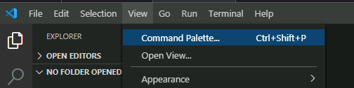

import Tabs from '@theme/Tabs';
import TabItem from '@theme/TabItem';

## Overview

This Ubuntu VM image will be staged with packages used to support multiple lab exercises.

Deploy this VM on your assigned cluster if directed to do so as part of **Lab Setup**.


## Upload Linux Tools VM Image

:::caution

Check if ``ubuntu 24.04`` image exists first before deploying.

If you are in a lab environment, only one participant needs to add this.

:::

1. In Prism Central > Select Compute and Storage > Images  
2. Click on Add Image 
3. Select the URL radio button and paste the following image URL
   
   ```bash
   https://cloud-images.ubuntu.com/releases/24.04/release/ubuntu-24.04-server-cloudimg-amd64.img
   ```
4. Click on Upload File and in the description add your *Initials*
5. Click on Next and select Place Image Directly on cluster
6. Click on Save
   
## Deploying Linux Tools VM

:::caution

Only deploy the VM once with a username (see [Lookup](https://lookupamer.apj-cxrules.win/) tool) in the VM name.

:::

1. In **Prism Central** > select **Menu** > **Compute and Storage > VMs**, and click **Create VM**

2.  Fill out the following fields:
    -   **Name** - ocpuserXX-Linux-ToolsVM 
    -   **Description** - (Optional) Description for your VM.
    -   **Number of VMs** - 1
    -   **CPU(s)** - 6
    -   **Number of Cores per CPU** - 1
    -   **Memory** - 8 GiB
3.  Click **Next**
4.  Under **Disks** select **Attach Disk**
    -   **Type** - DISK
    -   **Operation** - Clone from Image
    -   **Image** - ``ubuntu-24.04-server-cloudimg-amd64.img``
    -   **Capacity** - 100 GiB
    -   **Bus Type** - leave at default SCSI Setting
5.  Click **Save**
6.  Under **Networks** select **Attach to Subnet**
    -   **VLAN Name** - primary-XXX-XXXX
    -   **Network Connection State** - Connected
    -   **Assignment Type** - Assign with DHCP
7.  Click **Save**
8.  Click **Next** at the bottom
9.  In **Management** section
    -   **Categories** - leave blank
    -   **Timezone** - leave at default UTC
    -   **Guest Customization** - 
        - **Script Type** - Cloud-init (Linux)
        - **Configuration Method** - Custom Script 
         
          You will need to create ssh key-pair to use in the cloud-init yaml content (script)

          <details>

          <summary>Do you need to create a SSH key pair?</summary>
           
           Execute the following commands in a terminal you are in a Linux / Mac environment to generate a private key.

           Use PowerShell in windows environments.
    
           ```bash
           ssh-keygen -t rsa -b 2048 -C "Created for Linux Tools VM"
           
           # follow prompts 
           # do not specify passphrase
           # once completed run the following command
           
           cat id_rsa.pub
           
           # copy the contents of the id_rsa.pub file to your cloudinit yaml file
           ```
          </details>

        - Paste the following script in the script window once you have access to your ssh key-pair.
        
         ```yaml {2,22} title="Remember to change to your hostname ocpuserXX-LinuxToolsVM"
         #cloud-config
         hostname: ocpuserXX-LinuxToolsVM                    # << Change to your user name >>
         package_update: true
         package_upgrade: true
         package_reboot_if_required: true
         packages:
           - open-iscsi
           - nfs-common
           - git
           - jq
           - bind-utils
           - nmap
           - docker.io
         users:
           - default
           - name: ubuntu
             groups: sudo
             shell: /bin/bash
             sudo:
               - 'ALL=(ALL) NOPASSWD:ALL'
             ssh-authorized-keys: 
             - ssh-rsa AAAAB3Nxxxxxxxx ...                  # << Paste your SSH public key >>
         runcmd:
           - systemctl stop ufw && systemctl disable ufw
           - usermod -aG docker ubuntu
           - 'curl -Lo /usr/local/bin/kubectl https://storage.googleapis.com/kubernetes-release/release/$(curl -s https://storage.googleapis.com/kubernetes-release/release/stable.txt)/bin/linux/amd64/kubectl'
           - chmod +x /usr/local/bin/kubectl
           - 'curl https://raw.githubusercontent.com/helm/helm/main/scripts/get-helm-3 | bash'
           - 'su - ubuntu -c "curl -fsSL https://raw.githubusercontent.com/ariesbabu/ocp-gitp/refs/heads/main/docs/toolsvms/install_vscode_tools.sh | bash"'
           - eject
           - reboot
         ```


10. Click on **Next**
11. Click **Create VM** at the bottom
12. Go back to **Prism Central** > **Menu** > **Compute and Storage** > **VMs**
13. Select your *ocpuserXX*-Linux-ToolsVM
14. Under **Actions** drop-down menu, choose **Power On**

    :::caution
    It may take up to 10 minutes for the VM to be ready. The VM will reboot once to finish the installation process.
    
    You can watch the console of the VM from Prism Central to make sure all the cloudinit script has finished running.

    Cloudinit logs are stored in /var/log/cloud-init.log
    
    Logon to the tools VM using SSH 

    ```bash
    ssh -l ubuntu _your_jumphost_ip # Get the IP address of the jumphost VM from Prism UI
    ```
    
    Monitor the ``cloudinit`` process logs

    ```bash
    tail -f /var/log/cloud-init.log
    ```
    :::

15. Get the IP address of the jumphost VM from Prism UI

### Connect to you Jumpbox using VSCode

<Tabs>
<TabItem value="VSCode on Browser" label="VSCode on Browser">

```mdx-code-block
#### Connect to you Jumpbox using VSCode on Browser using Password

:::caution

The code-server will take a few minutes to come online.

:::

1. In you browser visit the following URL
   
   <Tabs>
      <TabItem value="Template URL" label="Template URL" default>

      ```url
      https://_your_jumphost_ip
      ```
      </TabItem>
      <TabItem value="Example URL" label="Example URL">

      ```url
      https://10.54.63.96
      ```

      </TabItem>
   </Tabs>

2. Enter ``_password`` as the password

2. Open the following file in VSCode Explorer window

   ```bash
   /home/ubuntu/.config/code-server/config.yaml
   ```
4. Change the password to your desired password
   
   ```bash {3}
   bind-addr: 0.0.0.0:443  # Only bind to localhost
   auth: password
   password: _desired_password # Replace with a strong password
   cert: true
   ```

5. Restart VSCode server daemon

   ```bash
   sudo systemctl restart code-server@$USER
   ```

   :::caution
   This will take a minute or so
   :::

6. Connect to VSCode on the browser and login using the new password 

</TabItem>

<TabItem value="VSCode on Mac/PC" label="VSCode on Mac/PC (Faster)">

```mdx-code-block
#### Connect to you Jumpbox using VSCode on Mac/PC using SSH Key

If you already have VSCode installed on your workstation (PC/Mac) follow these instructions to connect:

1. In VSCode, click on Settings menu icon (gear icon) :gear: > **Settings** > **Extensions**
2. In the search window search for **Remote SSH**
3. Install the [Remote-SSH Extension](https://marketplace.visualstudio.com/items?itemName=ms-vscode-remote.remote-ssh) from VSCode Marketplace
4. click on the **Install** button for the extenstion.

5. From your workstation, open **Visual Studio Code**.

6. Click **View > Command Palette**.

    

7. Click on **+ Add New SSH Host**

    

8. Type ``ssh ubuntu@jumphost_VM-IP-ADDRESS``and hit **Enter**.

    

9. Select the location to update the config file.

   <Tabs>
      <TabItem value="Mac Location" label="Mac Location" default>

      ```bash
      /Users/_your_username/.ssh/config
      ```
      </TabItem>
      <TabItem value="PC Location" label="PC Location">

      ```bash
      C:\\Users\\_your_username\\.ssh\\config
      ```

      </TabItem>
   </Tabs>

1.  Open the ssh config file on your workstation to verify the contents. It should be similar to the following content

    ```yaml
    Host jumphost
        HostName 10.x.x.x # IP of Jumphost
        IdentityFile ~/.ssh/id_rsa # ssh private key location on Mac/PC
        User ubuntu
    ```

Now that we have saved the ssh credentials, we are able to connect to the jumphost VM

1. On `VSCode`, Click **View > Command Palette** and **Connect to Host**

2. Select the IP address of your `Jump Host` VM

3. A **New Window** :material-dock-window: will open in `VSCode`

4. Click the **Explorer** button from the left-hand toolbar and select **Open Folder**.
   
   

5. Provide the ``$HOME/`` as the folder you want to open and click on **OK**.

   :::note

   Ensure that **bin** is NOT highlighted otherwise the editor will attempt to autofill ``/bin/``. You can avoid this by clicking in the path field *before* clicking **OK**.
   :::

   :::warning
   
   The connection may take up to 1 minute to display the root folder structure of the jumphost VM.

   :::

6. Accept any warning message about trusting the author of the folder
   
   
```
</TabItem>
</Tabs>


### VSCode Terminal

From now we will work on the browser to access ``VSCode`` environment and Terminal

1. From VSCode hamburger **menu** 
2. Choose **Terminal** > **New Terminal**

   

3. For best visibility, place the Terminal on the right instead of the bottom
4. Choose hamburger **menu** > **View**
5. Choose **Appearance** > **Panel Position** > **Right** as shown here
   
   

   This setup allows to explore the files, edit it in VSCode editor and also execute commands. 

<!-- ## Install Utilities on Jumphost VM

We have compiled a list of utilities that needs to be installed on the jumphost VM to use for the rest of the lab. We have affectionately called it as ``nai-llm`` utilities. Use the following method to install these utilities:

1. Using `VSCode` in browser
   
2. Click the menu (hamburger) icon followed by Terminal and New Terminal

3. Install `devbox` using the following command and accept all defaults

    ```sh
    curl -fsSL https://get.jetpack.io/devbox | bash
    ```

4. From the ``$HOME`` directory, clone the ``sol-cnai-infra`` git repo and change working directory

    ```bash
    git clone https://github.com/nutanix-japan/sol-cnai-infra.git
    cd $HOME/sol-cnai-infra/
    ```

5. Start the `devbox shell`. If `nix` isn't available, you will be prompted to install:

    ```sh
    devbox init
    devbox shell
    ```

6. Run Post VM Create - Workstation Bootstrapping tasks
  
    ```bash
    sudo snap install task --classic
    ```
    ```bash
    task ws:install-packages ws:load-dotfiles --yes -d $HOME/sol-cnai-infra/
    ```
    ```bash
    source ~/.bashrc
    ```

7. Change working directory and see ``Task`` help
  
    ```bash
    cd $HOME/sol-cnai-infra/ && task
    ```

    ``` { .bash .no-copy }
    # command output
    task: bootstrap:silent

    Silently initializes cluster configs, git local/remote & fluxcd

    See README.md for additional details on Getting Started

    To see list of tasks, run `task --list` or `task --list-all`

    dependencies:
    - bootstrap:default

    commands:
    - Task: bootstrap:generate_local_configs
    - Task: bootstrap:verify-configs
    - Task: bootstrap:generate_cluster_configs
    - Task: nke:download-creds 
    - Task: flux:init
    ```

### Setup Docker on Jumphost

1. From VSC, logon to your jumpbox VM
2. Open VSC Terminal
3. Run the following commands to install ``docker`` binaries

    ```bash
    cd $HOME/sol-cnai-infra/; devbox init; devbox shell
    task workstation:install-docker
    ```

    :::tip

    Restart the jumpbox host if ``ubuntu`` user has permission issues using ``docker`` commands. -->

Now the jumphost VM is ready with all the tools to deploy other sections on this site. 
